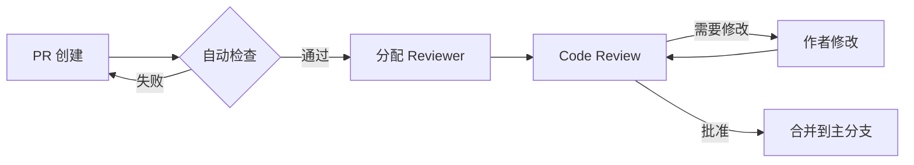

# 单词学习应用重构路线图 2025

> **文档版本**: v1.0
> **创建日期**: 2025-12-13
> **负责团队**: 技术架构组
> **状态**: 规划中

---

## 📊 执行摘要

### 当前状态快照

- **代码规模**: 后端 83,620 行 | 前端 ~50,000 行 | 测试 74,140 行
- **核心模块**:
  - `engine.ts`: 2,359 行 (单一职责违反)
  - `amas.service.ts`: 1,607 行 (上帝类反模式)
- **技术债务**:
  - 143 个失败测试套件
  - 20+ TypeScript 编译错误
  - 循环依赖和紧耦合
- **架构问题**:
  - 服务层过度膨胀 (45个服务类)
  - 缺乏清晰的领域边界
  - 缺乏 API 版本控制

### 业务影响分析

- **开发效率**: 新功能开发周期延长 40%
- **维护成本**: Bug 修复平均耗时 +35%
- **团队协作**: 代码冲突率 25%
- **系统稳定性**: 月均生产事故 3-5 次

### 预期收益 (6个月后)

- ✅ 开发效率提升 **50%**
- ✅ 测试覆盖率达到 **80%+**
- ✅ 代码可维护性提升 **60%**
- ✅ 部署频率提升 **3x**
- ✅ 平均修复时间减少 **50%**

---

## 🎯 重构优先级矩阵

### 关键维度评分 (1-10)

| 模块/组件            | 影响范围 | 技术风险 | 业务紧急度 | ROI | 总分   | 优先级 |
| -------------------- | -------- | -------- | ---------- | --- | ------ | ------ |
| **AMAS Engine 拆分** | 10       | 9        | 8          | 9   | **36** | 🔴 P0  |
| **AMASService 重构** | 9        | 7        | 9          | 8   | **33** | 🔴 P0  |
| **API 版本控制**     | 8        | 5        | 7          | 9   | **29** | 🟡 P1  |
| **测试体系重建**     | 7        | 6        | 8          | 8   | **29** | 🟡 P1  |
| **前端组件库**       | 6        | 4        | 6          | 7   | **23** | 🟢 P2  |
| **数据库Schema演进** | 5        | 8        | 5          | 6   | **24** | 🟢 P2  |
| **监控可观测性**     | 4        | 3        | 7          | 7   | **21** | 🟢 P2  |
| **文档体系**         | 3        | 2        | 5          | 6   | **16** | 🔵 P3  |

### 评分标准说明

**影响范围** (1-10):

- 10: 核心引擎,影响全系统
- 7-9: 关键业务模块
- 4-6: 独立功能模块
- 1-3: 工具和辅助功能

**技术风险** (1-10):

- 10: 极高风险,无测试覆盖
- 7-9: 高风险,部分测试
- 4-6: 中等风险,测试覆盖50%+
- 1-3: 低风险,测试完善

**业务紧急度** (1-10):

- 10: 阻塞新功能开发
- 7-9: 严重影响开发效率
- 4-6: 影响用户体验
- 1-3: 优化改进

**ROI 投资回报** (1-10):

- 10: 立即见效,长期高价值
- 7-9: 短期见效,中长期价值
- 4-6: 中期见效
- 1-3: 长期价值

---

## 🏗️ Phase 1: 核心引擎解耦 (月1-2)

### 里程碑: AMAS Engine 模块化重构

**目标**: 将 2,359 行的巨型 `engine.ts` 拆分为清晰的职责模块

#### 1.1 战术拆分策略 (Week 1-2)

**当前问题诊断**:

```typescript
// 问题: engine.ts 包含了太多职责
// - 引擎编排逻辑
// - 类型定义 (400+ 行)
// - 弹性保护
// - 用户隔离
// - 建模层管理
// - 学习层管理
// - 持久化管理
// - 决策轨迹记录
// - 特征向量构建
// - 奖励配置缓存
```

**重构模式应用**:

##### Extract Class (提取类)

```typescript
// 目标结构:
src/amas/core/
  ├── engine.ts                    // 核心编排 (~300行)
  ├── types/
  │   ├── index.ts                 // 统一导出
  │   ├── models.ts                // 数据模型
  │   ├── interfaces.ts            // 接口定义
  │   └── enums.ts                 // 枚举常量
  ├── orchestration/
  │   ├── pipeline-orchestrator.ts // 流水线编排
  │   ├── stage-executor.ts        // 阶段执行器
  │   └── context-builder.ts       // 上下文构建
  ├── isolation/
  │   ├── user-isolation.ts        // 用户隔离
  │   ├── state-manager.ts         // 状态管理
  │   └── model-manager.ts         // 模型管理
  ├── resilience/
  │   ├── circuit-breaker.ts       // 熔断器
  │   ├── fallback-handler.ts      // 降级处理
  │   └── timeout-guard.ts         // 超时保护
  └── telemetry/
      ├── decision-tracer.ts       // 决策追踪
      ├── metrics-collector.ts     // 指标收集
      └── performance-monitor.ts   // 性能监控
```

##### Move Method (移动方法)

**步骤 1**: 识别职责边界

```typescript
// 分析方法归属
class AMASEngine {
  // 编排职责 -> 保留
  processEvent()

  // 类型定义 -> 迁移到 types/
  interface UserModels
  interface ProcessOptions

  // 弹性保护 -> 迁移到 resilience/
  handleCircuitBreaker()
  applyTimeout()

  // 追踪记录 -> 迁移到 telemetry/
  recordDecisionTrace()
  collectMetrics()
}
```

**步骤 2**: 渐进式迁移

```typescript
// Week 1: 类型定义迁移
// 1. 创建新的类型模块
// 2. 保留原始位置的 type alias
// 3. 更新导入路径
// 4. 删除原始定义

// Week 2: 功能模块迁移
// 1. 提取为独立类
// 2. 依赖注入改造
// 3. 单元测试编写
// 4. 集成测试验证
```

#### 1.2 引入依赖注入 (Week 3)

**问题**: 硬编码依赖,难以测试和扩展

**解决方案**: IoC 容器 + 依赖注入

```typescript
// 使用 tsyringe 或 inversify
import { container, injectable, inject } from 'tsyringe';

@injectable()
export class AMASEngine {
  constructor(
    @inject('IStateRepository') private stateRepo: IStateRepository,
    @inject('IModelRepository') private modelRepo: IModelRepository,
    @inject('IPipelineOrchestrator') private orchestrator: IPipelineOrchestrator,
    @inject('IResilienceManager') private resilience: IResilienceManager,
    @inject('ITelemetryCollector') private telemetry: ITelemetryCollector,
  ) {}

  async processEvent(userId: string, event: RawEvent): Promise<ProcessResult> {
    // 编排逻辑
    const context = await this.orchestrator.buildContext(userId, event);
    const result = await this.orchestrator.execute(context);
    await this.telemetry.record(result);
    return result;
  }
}

// 配置容器
container.register<IStateRepository>('IStateRepository', {
  useClass: DatabaseStateRepository,
});
```

#### 1.3 测试策略 (Week 4)

**分层测试**:

```typescript
// 1. 单元测试 - 隔离测试每个模块
describe('PipelineOrchestrator', () => {
  let orchestrator: PipelineOrchestrator;
  let mockStateRepo: jest.Mocked<IStateRepository>;

  beforeEach(() => {
    mockStateRepo = createMockStateRepository();
    orchestrator = new PipelineOrchestrator(mockStateRepo);
  });

  it('should build context with user state', async () => {
    // 测试逻辑
  });
});

// 2. 集成测试 - 测试模块协作
describe('AMASEngine Integration', () => {
  let engine: AMASEngine;
  let testContainer: DependencyContainer;

  beforeEach(() => {
    testContainer = setupTestContainer();
    engine = testContainer.resolve(AMASEngine);
  });

  it('should process event end-to-end', async () => {
    // 测试逻辑
  });
});

// 3. 契约测试 - 确保接口稳定性
describe('AMASEngine Contract', () => {
  it('should maintain backward compatibility', () => {
    // 验证公共 API 不变
  });
});
```

**测试覆盖率目标**:

- 单元测试: **85%+**
- 集成测试: **70%+**
- 契约测试: **100%** (所有公共接口)

#### 1.4 风险控制措施

**回滚策略**:

```typescript
// 1. Feature Toggle - 新旧实现并存
const useNewEngine = process.env.USE_NEW_AMAS_ENGINE === 'true';

export function createAMASEngine(): IAMASEngine {
  if (useNewEngine) {
    return container.resolve(NewAMASEngine);
  }
  return new LegacyAMASEngine(); // 保留旧实现
}

// 2. 金丝雀发布 - 逐步放量
const canaryUsers = ['user-001', 'user-002']; // 1% 用户
if (canaryUsers.includes(userId)) {
  return createNewEngine();
}
return createLegacyEngine();
```

**监控指标**:

- 响应时间对比 (P50, P95, P99)
- 错误率变化
- 决策质量对比 (A/B 测试)
- 资源使用 (内存, CPU)

---

## 🔧 Phase 2: 服务层重构 (月2-3)

### 里程碑: AMASService 拆分与职责明确

**目标**: 将 1,607 行的 `amas.service.ts` 重构为领域驱动的服务集合

#### 2.1 领域模型识别

**当前问题**:

```typescript
// AMASService 承担了过多职责:
class AMASService {
  processLearningEvent(); // 学习事件处理
  applyDelayedReward(); // 延迟奖励
  batchProcessEvents(); // 批处理
  getUserState(); // 状态查询
  resetUser(); // 用户重置
  getColdStartPhase(); // 冷启动
  persistFeatureVector(); // 特征向量持久化
  ensureLearningSession(); // 会话管理
  getUserStats(); // 统计数据
  getWordReviewHistory(); // 复习历史
  calculateWordMasteryDecision(); // 掌握度判定
  updateRecentEvents(); // 事件缓存
  buildBehaviorSignals(); // 行为信号
  computeDueTs(); // 到期时间
  mapToMasteryLevel(); // 掌握等级映射
  mapToWordState(); // 状态映射
  // ... 20+ 方法
}
```

**DDD 领域拆分**:

```typescript
// 1. 学习会话领域
src/amas/domains/learning-session/
  ├── learning-session.service.ts      // 会话管理
  ├── learning-session.repository.ts   // 会话持久化
  ├── learning-event-handler.ts        // 事件处理
  └── learning-event.types.ts          // 事件类型

// 2. 奖励计算领域
src/amas/domains/reward/
  ├── reward-calculator.service.ts     // 奖励计算
  ├── delayed-reward.service.ts        // 延迟奖励
  ├── reward-profile.service.ts        // 奖励配置
  └── reward.types.ts                  // 奖励类型

// 3. 用户状态领域
src/amas/domains/user-state/
  ├── user-state.service.ts            // 状态管理
  ├── user-state.repository.ts         // 状态持久化
  ├── user-stats.service.ts            // 统计服务
  └── cold-start.service.ts            // 冷启动服务

// 4. 单词掌握度领域
src/amas/domains/word-mastery/
  ├── word-mastery.service.ts          // 掌握度服务
  ├── mastery-calculator.ts            // 掌握度计算
  ├── review-history.service.ts        // 复习历史
  └── forgetting-curve.service.ts      // 遗忘曲线

// 5. 行为分析领域
src/amas/domains/behavior-analysis/
  ├── flow-detector.service.ts         // 心流检测
  ├── emotion-detector.service.ts      // 情绪检测
  ├── behavior-signal.service.ts       // 行为信号
  └── recent-events.cache.ts           // 事件缓存

// 6. 特征工程领域
src/amas/domains/feature-engineering/
  ├── feature-vector.service.ts        // 特征向量
  ├── feature-builder.ts               // 特征构建
  └── feature-persistence.service.ts   // 特征持久化
```

#### 2.2 重构模式应用

##### Extract Service (提取服务)

**示例: 延迟奖励服务**

```typescript
// 之前: 在 AMASService 中
class AMASService {
  private async computeDueTs(userId, wordId, eventTs) {
    // 70 行逻辑
  }

  async applyDelayedReward(userId, reward, sessionId) {
    // 130 行逻辑
  }
}

// 之后: 独立的领域服务
@injectable()
export class DelayedRewardService {
  constructor(
    @inject('IRewardCalculator') private calculator: IRewardCalculator,
    @inject('IRewardRepository') private repository: IRewardRepository,
    @inject('IFeatureVectorService') private featureService: IFeatureVectorService,
  ) {}

  async scheduleReward(params: ScheduleRewardParams): Promise<void> {
    const dueDate = await this.calculator.calculateDueDate(params);
    await this.repository.enqueue({ ...params, dueDate });
  }

  async applyReward(params: ApplyRewardParams): Promise<RewardResult> {
    const features = await this.featureService.load(params.answerRecordId);
    return await this.calculator.apply(features, params.reward);
  }
}
```

##### Replace Method with Method Object (方法对象)

**示例: 掌握度计算**

```typescript
// 之前: 100+ 行的复杂方法
async calculateWordMasteryDecision(userId, wordId, isCorrect, responseTime, state) {
  // 1. 查询历史数据
  // 2. 计算认知得分
  // 3. 计算历史得分
  // 4. 计算当前表现
  // 5. 综合判定
  // ... 100+ 行
}

// 之后: 方法对象模式
@injectable()
export class WordMasteryCalculator {
  constructor(
    @inject('ILearningStateRepository') private stateRepo: ILearningStateRepository,
    @inject('IAnswerRecordRepository') private answerRepo: IAnswerRecordRepository
  ) {}

  async calculate(params: MasteryCalculationParams): Promise<MasteryDecision> {
    const context = await this.buildContext(params);

    const cognitiveScore = this.calculateCognitiveScore(context);
    const historyScore = this.calculateHistoryScore(context);
    const performanceScore = this.calculatePerformanceScore(context);

    return this.makeDecision({
      cognitiveScore,
      historyScore,
      performanceScore
    });
  }

  private async buildContext(params: MasteryCalculationParams): Promise<MasteryContext> {
    // 数据准备逻辑
  }

  private calculateCognitiveScore(context: MasteryContext): number {
    // 认知得分逻辑 (清晰独立)
  }

  private calculateHistoryScore(context: MasteryContext): number {
    // 历史得分逻辑
  }

  private calculatePerformanceScore(context: MasteryContext): number {
    // 表现得分逻辑
  }

  private makeDecision(scores: MasteryScores): MasteryDecision {
    // 决策逻辑
  }
}
```

#### 2.3 迁移时间表

**Week 1-2: 领域识别与设计**

- [ ] 绘制领域边界图
- [ ] 定义领域接口
- [ ] 评审设计方案
- [ ] 编写技术规范

**Week 3-4: 核心领域迁移**

- [ ] 迁移学习会话领域
- [ ] 迁移奖励计算领域
- [ ] 编写单元测试
- [ ] 集成测试验证

**Week 5-6: 扩展领域迁移**

- [ ] 迁移用户状态领域
- [ ] 迁移单词掌握度领域
- [ ] 迁移行为分析领域
- [ ] 编写集成测试

**Week 7-8: 收尾与优化**

- [ ] 迁移特征工程领域
- [ ] 性能优化
- [ ] 文档编写
- [ ] 代码评审

#### 2.4 向后兼容策略

**适配器模式**:

```typescript
// 保持原有 AMASService 接口不变
@injectable()
export class AMASService implements IAMASService {
  constructor(
    @inject('ILearningSessionService') private sessionService: ILearningSessionService,
    @inject('IDelayedRewardService') private rewardService: IDelayedRewardService,
    @inject('IUserStateService') private stateService: IUserStateService,
    @inject('IWordMasteryService') private masteryService: IWordMasteryService,
  ) {}

  // 保持原有方法签名
  async processLearningEvent(userId: string, event: LearningEvent): Promise<ProcessResult> {
    // 委托给新的领域服务
    return await this.sessionService.processEvent(userId, event);
  }

  async applyDelayedReward(
    userId: string,
    reward: number,
    sessionId?: string,
  ): Promise<RewardResult> {
    return await this.rewardService.applyReward({ userId, reward, sessionId });
  }

  // ... 其他方法类似
}
```

---

## 🌐 Phase 3: API 版本控制 (月3-4)

### 里程碑: 建立 API 版本化体系

**目标**: 引入 REST API 版本控制,支持平滑演进

#### 3.1 版本化策略

**URL 路径版本控制**:

```typescript
// 目录结构
src/routes/
  ├── v1/                           // 当前稳定版本
  │   ├── learning.routes.ts
  │   ├── user.routes.ts
  │   └── word.routes.ts
  ├── v2/                           // 新版本 API
  │   ├── learning.routes.ts        // 重构后的学习 API
  │   ├── user.routes.ts
  │   └── word.routes.ts
  └── index.ts                      // 版本路由注册

// 路由注册
app.use('/api/v1', v1Router);
app.use('/api/v2', v2Router);
```

**响应头版本控制 (备选)**:

```typescript
// 客户端指定版本
GET /api/learning/events
Headers:
  Accept: application/vnd.danci.v2+json

// 服务端响应
HTTP/1.1 200 OK
Content-Type: application/vnd.danci.v2+json
API-Version: 2.0
```

#### 3.2 v1 → v2 演进计划

**Breaking Changes 清单**:

1. **学习事件 API 重构**

```typescript
// v1 (现有)
POST /api/learning/event
{
  "wordId": "string",
  "isCorrect": boolean,
  "responseTime": number,
  "dwellTime": number,
  // 10+ 扁平字段
}

// v2 (改进)
POST /api/v2/learning/sessions/{sessionId}/events
{
  "wordId": "string",
  "result": {
    "correct": boolean,
    "responseTimeMs": number
  },
  "interaction": {
    "dwellTimeMs": number,
    "pauseCount": number,
    "retryCount": number
  },
  "context": {
    "pausedTimeMs": number
  }
}
```

2. **响应格式标准化**

```typescript
// v1 (不一致)
{
  "strategy": {...},
  "state": {...},
  "explanation": "string"
}

// v2 (标准化)
{
  "data": {
    "strategy": {...},
    "state": {...}
  },
  "meta": {
    "explanation": "string",
    "confidence": 0.95,
    "version": "2.0"
  },
  "links": {
    "self": "/api/v2/learning/events/123",
    "session": "/api/v2/learning/sessions/456"
  }
}
```

3. **错误响应标准化**

```typescript
// v2 统一错误格式
{
  "error": {
    "code": "INVALID_EVENT",
    "message": "Learning event validation failed",
    "details": [
      {
        "field": "responseTime",
        "issue": "must be positive integer"
      }
    ]
  },
  "meta": {
    "requestId": "req_123",
    "timestamp": "2025-12-13T10:00:00Z",
    "apiVersion": "2.0"
  }
}
```

#### 3.3 版本生命周期管理

**版本策略**:

- **v1**: 维护模式 (仅修 bug,18个月后弃用)
- **v2**: 活跃开发 (新功能,性能优化)
- **v3**: 规划中 (GraphQL 支持)

**弃用流程**:

```typescript
// 1. 标记弃用 (Month 1)
app.use('/api/v1', (req, res, next) => {
  res.setHeader('Deprecation', 'true');
  res.setHeader('Sunset', 'Sat, 31 Dec 2026 23:59:59 GMT');
  res.setHeader('Link', '</api/v2>; rel="successor-version"');
  next();
});

// 2. 日志告警 (Month 3)
logger.warn('API v1 usage detected', {
  endpoint: req.path,
  user: req.user.id,
  deprecationDate: '2026-12-31',
});

// 3. 强制迁移 (Month 18)
app.use('/api/v1', (req, res) => {
  res.status(410).json({
    error: 'API version 1 has been sunset',
    upgradeGuide: 'https://docs.danci.app/api/migration/v1-to-v2',
  });
});
```

#### 3.4 迁移工具

**自动化迁移助手**:

```typescript
// 提供工具类帮助客户端迁移
export class APIVersionAdapter {
  // v1 -> v2 请求适配
  static adaptRequestV1ToV2(v1Request: V1LearningEvent): V2LearningEvent {
    return {
      wordId: v1Request.wordId,
      result: {
        correct: v1Request.isCorrect,
        responseTimeMs: v1Request.responseTime,
      },
      interaction: {
        dwellTimeMs: v1Request.dwellTime || 0,
        pauseCount: v1Request.pauseCount || 0,
        retryCount: v1Request.retryCount || 0,
      },
      context: {
        pausedTimeMs: v1Request.pausedTimeMs || 0,
      },
    };
  }

  // v2 -> v1 响应适配 (向后兼容)
  static adaptResponseV2ToV1(v2Response: V2ProcessResult): V1ProcessResult {
    return {
      strategy: v2Response.data.strategy,
      state: v2Response.data.state,
      explanation: v2Response.meta.explanation,
    };
  }
}
```

---

## 🧪 Phase 4: 测试体系重建 (月4-5)

### 里程碑: 建立全面的测试金字塔

**目标**: 从 143 个失败测试 → 80%+ 覆盖率的健康测试套件

#### 4.1 测试金字塔分层

```
         /\
        /  \  E2E Tests (10%)
       /____\
      /      \  Integration Tests (30%)
     /________\
    /          \  Unit Tests (60%)
   /____________\
```

**覆盖率目标**:

- **单元测试**: 85% (核心逻辑 100%)
- **集成测试**: 70% (关键路径 100%)
- **E2E 测试**: 50% (核心用户流程)

#### 4.2 测试策略重构

##### 4.2.1 单元测试重构

**当前问题**:

- 测试依赖真实数据库 (慢,不稳定)
- Mock 不充分 (测试脆弱)
- 测试耦合 (一个改动破坏多个测试)

**解决方案**:

```typescript
// 1. 使用 Test Fixtures 和 Factory Pattern
export class TestDataFactory {
  static createUser(overrides?: Partial<User>): User {
    return {
      id: 'test-user-001',
      email: 'test@example.com',
      username: 'testuser',
      ...overrides,
    };
  }

  static createLearningEvent(overrides?: Partial<LearningEvent>): LearningEvent {
    return {
      wordId: 'word-001',
      isCorrect: true,
      responseTime: 3000,
      timestamp: Date.now(),
      ...overrides,
    };
  }
}

// 2. 使用 In-Memory Repository
export class InMemoryUserRepository implements IUserRepository {
  private users: Map<string, User> = new Map();

  async save(user: User): Promise<void> {
    this.users.set(user.id, user);
  }

  async findById(id: string): Promise<User | null> {
    return this.users.get(id) || null;
  }
}

// 3. 测试隔离
describe('LearningSessionService', () => {
  let service: LearningSessionService;
  let userRepo: InMemoryUserRepository;
  let eventRepo: InMemoryEventRepository;

  beforeEach(() => {
    userRepo = new InMemoryUserRepository();
    eventRepo = new InMemoryEventRepository();
    service = new LearningSessionService(userRepo, eventRepo);
  });

  it('should create session for new user', async () => {
    const user = TestDataFactory.createUser();
    await userRepo.save(user);

    const session = await service.createSession(user.id);

    expect(session).toBeDefined();
    expect(session.userId).toBe(user.id);
  });
});
```

##### 4.2.2 集成测试重构

**使用 Testcontainers 进行真实数据库测试**:

```typescript
import { PostgreSqlContainer } from '@testcontainers/postgresql';

describe('AMASService Integration', () => {
  let container: PostgreSqlContainer;
  let prisma: PrismaClient;
  let service: AMASService;

  beforeAll(async () => {
    // 启动测试数据库容器
    container = await new PostgreSqlContainer()
      .withDatabase('test_db')
      .withUsername('test')
      .withPassword('test')
      .start();

    // 初始化 Prisma
    process.env.DATABASE_URL = container.getConnectionString();
    prisma = new PrismaClient();
    await prisma.$connect();

    // 运行迁移
    execSync('npx prisma migrate deploy');

    // 初始化服务
    service = new AMASService(prisma);
  }, 60000);

  afterAll(async () => {
    await prisma.$disconnect();
    await container.stop();
  });

  beforeEach(async () => {
    // 清理数据
    await prisma.user.deleteMany();
  });

  it('should process learning event end-to-end', async () => {
    const user = await prisma.user.create({
      data: TestDataFactory.createUser(),
    });

    const result = await service.processLearningEvent(
      user.id,
      TestDataFactory.createLearningEvent(),
    );

    expect(result.strategy).toBeDefined();

    // 验证数据库状态
    const savedEvent = await prisma.answerRecord.findFirst({
      where: { userId: user.id },
    });
    expect(savedEvent).toBeDefined();
  });
});
```

##### 4.2.3 E2E 测试

**使用 Playwright 进行用户流程测试**:

```typescript
import { test, expect } from '@playwright/test';

test.describe('Learning Flow', () => {
  test('complete learning session', async ({ page }) => {
    // 1. 登录
    await page.goto('/login');
    await page.fill('[data-testid=email]', 'test@example.com');
    await page.fill('[data-testid=password]', 'password123');
    await page.click('[data-testid=login-button]');

    // 2. 开始学习会话
    await page.click('[data-testid=start-learning]');
    await expect(page.locator('[data-testid=learning-card]')).toBeVisible();

    // 3. 答题
    await page.click('[data-testid=answer-option-a]');
    await page.click('[data-testid=submit-answer]');

    // 4. 验证反馈
    await expect(page.locator('[data-testid=feedback]')).toContainText('正确');

    // 5. 验证状态更新
    const statsText = await page.locator('[data-testid=session-stats]').textContent();
    expect(statsText).toContain('1/10');
  });
});
```

#### 4.3 测试基础设施

**CI/CD 集成**:

```yaml
# .github/workflows/test.yml
name: Test Suite

on: [push, pull_request]

jobs:
  unit-tests:
    runs-on: ubuntu-latest
    steps:
      - uses: actions/checkout@v3
      - uses: pnpm/action-setup@v2
      - run: pnpm install
      - run: pnpm test:unit
      - uses: codecov/codecov-action@v3
        with:
          file: ./coverage/unit/lcov.info
          flags: unit

  integration-tests:
    runs-on: ubuntu-latest
    services:
      postgres:
        image: postgres:16
        env:
          POSTGRES_PASSWORD: test
        options: >-
          --health-cmd pg_isready
          --health-interval 10s
    steps:
      - uses: actions/checkout@v3
      - uses: pnpm/action-setup@v2
      - run: pnpm install
      - run: pnpm test:integration
      - uses: codecov/codecov-action@v3
        with:
          file: ./coverage/integration/lcov.info
          flags: integration

  e2e-tests:
    runs-on: ubuntu-latest
    steps:
      - uses: actions/checkout@v3
      - uses: pnpm/action-setup@v2
      - run: pnpm install
      - run: pnpm build
      - run: pnpm test:e2e
      - uses: actions/upload-artifact@v3
        if: failure()
        with:
          name: playwright-screenshots
          path: test-results/
```

**测试覆盖率报告**:

```typescript
// vitest.config.ts
export default defineConfig({
  test: {
    coverage: {
      provider: 'v8',
      reporter: ['text', 'json', 'html', 'lcov'],
      exclude: ['node_modules/', 'test/', '**/*.test.ts', '**/*.spec.ts'],
      thresholds: {
        lines: 85,
        functions: 85,
        branches: 80,
        statements: 85,
      },
    },
  },
});
```

#### 4.4 时间表

**Week 1-2: 基础设施搭建**

- [ ] 配置 Testcontainers
- [ ] 建立 Test Fixtures 库
- [ ] 配置 CI/CD 流水线
- [ ] 编写测试指南文档

**Week 3-5: 核心模块测试**

- [ ] AMAS Engine 单元测试 (300+ 测试用例)
- [ ] 服务层集成测试 (150+ 测试用例)
- [ ] 覆盖率达到 70%+

**Week 6-8: 全面测试覆盖**

- [ ] 完成所有模块单元测试
- [ ] E2E 测试覆盖核心流程
- [ ] 覆盖率达到 80%+
- [ ] 性能基准测试

---

## 🎨 Phase 5: 前端重构 (月5-6)

### 里程碑: React 组件重构与状态管理优化

**目标**: 从命令式混乱代码 → 声明式清晰架构

#### 5.1 组件库建设

**原子设计系统**:

```
src/components/
  ├── atoms/                  // 原子组件
  │   ├── Button/
  │   ├── Input/
  │   ├── Badge/
  │   └── Icon/
  ├── molecules/              // 分子组件
  │   ├── FormField/
  │   ├── SearchBar/
  │   └── Card/
  ├── organisms/              // 有机体组件
  │   ├── LearningCard/
  │   ├── UserProfile/
  │   └── Dashboard/
  ├── templates/              // 模板
  │   ├── LearningPageTemplate/
  │   └── AdminPageTemplate/
  └── pages/                  // 页面
      ├── LearningPage/
      └── AdminPage/
```

**组件开发规范**:

```typescript
// 1. 使用 TypeScript 严格类型
interface LearningCardProps {
  wordId: string;
  word: string;
  onAnswer: (isCorrect: boolean) => void;
  disabled?: boolean;
}

// 2. 使用 React.FC 或函数组件
export const LearningCard: React.FC<LearningCardProps> = ({
  wordId,
  word,
  onAnswer,
  disabled = false
}) => {
  // 3. 使用自定义 Hooks 封装逻辑
  const { options, loading, error } = useLearningOptions(wordId);

  // 4. 使用 React Query 管理数据
  const submitAnswerMutation = useSubmitAnswer();

  // 5. 事件处理器使用 useCallback
  const handleAnswer = useCallback((optionId: string) => {
    const isCorrect = options.find(o => o.id === optionId)?.isCorrect;
    submitAnswerMutation.mutate({ wordId, optionId }, {
      onSuccess: () => onAnswer(isCorrect)
    });
  }, [wordId, options, onAnswer]);

  if (loading) return <Skeleton />;
  if (error) return <ErrorMessage error={error} />;

  return (
    <Card>
      <WordDisplay word={word} />
      <OptionList options={options} onSelect={handleAnswer} disabled={disabled} />
    </Card>
  );
};

// 6. 使用 Storybook 进行组件开发
export default {
  title: 'Organisms/LearningCard',
  component: LearningCard,
  parameters: {
    layout: 'centered'
  }
} as Meta;

export const Default: Story = {
  args: {
    wordId: 'word-001',
    word: 'refactor',
    onAnswer: action('onAnswer')
  }
};
```

#### 5.2 状态管理优化

**从 Redux → Zustand + React Query**:

```typescript
// 之前: Redux (冗长,样板代码多)
// actions/learning.actions.ts
export const submitAnswer = (wordId, answer) => ({
  type: 'SUBMIT_ANSWER',
  payload: { wordId, answer },
});

// reducers/learning.reducer.ts
export const learningReducer = (state, action) => {
  switch (action.type) {
    case 'SUBMIT_ANSWER':
      return { ...state, submitting: true };
    case 'SUBMIT_ANSWER_SUCCESS':
      return { ...state, submitting: false, result: action.payload };
    // ...
  }
};

// 之后: Zustand (简洁,类型安全)
// stores/learning.store.ts
import { create } from 'zustand';
import { devtools, persist } from 'zustand/middleware';

interface LearningState {
  currentSession: Session | null;
  sessionStats: SessionStats;

  startSession: () => void;
  endSession: () => void;
  resetSession: () => void;
}

export const useLearningStore = create<LearningState>()(
  devtools(
    persist(
      (set, get) => ({
        currentSession: null,
        sessionStats: { wordsCompleted: 0, accuracy: 0 },

        startSession: () => {
          set({
            currentSession: { id: generateId(), startTime: Date.now() },
          });
        },

        endSession: () => {
          set({ currentSession: null });
        },

        resetSession: () => {
          set({ sessionStats: { wordsCompleted: 0, accuracy: 0 } });
        },
      }),
      { name: 'learning-storage' },
    ),
  ),
);

// 使用 React Query 管理服务器状态
export function useLearningSession(sessionId: string) {
  return useQuery({
    queryKey: ['learning-session', sessionId],
    queryFn: () => api.getSession(sessionId),
    staleTime: 5 * 60 * 1000, // 5 minutes
    refetchOnWindowFocus: false,
  });
}

export function useSubmitAnswer() {
  const queryClient = useQueryClient();

  return useMutation({
    mutationFn: api.submitAnswer,
    onSuccess: (data, variables) => {
      // 乐观更新
      queryClient.setQueryData(['learning-session', variables.sessionId], (old) => ({
        ...old,
        wordsCompleted: old.wordsCompleted + 1,
      }));
    },
    onError: (error, variables) => {
      // 回滚
      queryClient.invalidateQueries({
        queryKey: ['learning-session', variables.sessionId],
      });
    },
  });
}
```

#### 5.3 性能优化

**1. 代码分割**:

```typescript
// 路由级别懒加载
const LearningPage = lazy(() => import('./pages/LearningPage'));
const AdminPage = lazy(() => import('./pages/AdminPage'));

// 组件级别条件加载
const HeavyChart = lazy(() => import('./components/HeavyChart'));

function Dashboard() {
  const [showChart, setShowChart] = useState(false);

  return (
    <div>
      <button onClick={() => setShowChart(true)}>Show Chart</button>
      {showChart && (
        <Suspense fallback={<Spinner />}>
          <HeavyChart />
        </Suspense>
      )}
    </div>
  );
}
```

**2. 虚拟滚动**:

```typescript
// 使用 react-window 处理大列表
import { FixedSizeList as List } from 'react-window';

function WordList({ words }: { words: Word[] }) {
  return (
    <List
      height={600}
      itemCount={words.length}
      itemSize={80}
      width="100%"
    >
      {({ index, style }) => (
        <div style={style}>
          <WordCard word={words[index]} />
        </div>
      )}
    </List>
  );
}
```

**3. React.memo 优化**:

```typescript
// 避免不必要的重渲染
export const WordCard = React.memo<WordCardProps>(
  ({ word, onSelect }) => {
    return (
      <Card onClick={() => onSelect(word.id)}>
        <h3>{word.text}</h3>
        <p>{word.definition}</p>
      </Card>
    );
  },
  (prevProps, nextProps) => {
    // 自定义比较逻辑
    return prevProps.word.id === nextProps.word.id;
  }
);
```

#### 5.4 时间表

**Week 1-2: 组件库建设**

- [ ] 建立设计系统
- [ ] 开发原子/分子组件
- [ ] 配置 Storybook
- [ ] 编写组件文档

**Week 3-4: 核心页面重构**

- [ ] 学习页面重构
- [ ] 用户中心重构
- [ ] 管理后台重构
- [ ] 状态管理迁移

**Week 5-6: 优化与测试**

- [ ] 性能优化
- [ ] 组件单元测试
- [ ] E2E 测试
- [ ] 可访问性测试

---

## 📊 Phase 6: 数据库Schema演进 (月6)

### 里程碑: 安全的数据库迁移

**目标**: 优化数据库设计,支持新功能,不影响生产

#### 6.1 Schema 问题识别

**当前痛点**:

1. **性能问题**: 缺少关键索引,查询慢
2. **数据冗余**: 未规范化,存在数据不一致风险
3. **扩展性差**: 硬编码枚举,难以扩展
4. **缺少审计**: 没有创建/更新时间戳

#### 6.2 优化策略

**1. 添加索引**:

```prisma
// schema.prisma
model AnswerRecord {
  id             String   @id @default(cuid())
  userId         String
  wordId         String
  isCorrect      Boolean
  responseTime   Int
  timestamp      DateTime @default(now())

  user User @relation(fields: [userId], references: [id])
  word Word @relation(fields: [wordId], references: [id])

  // 新增索引
  @@index([userId, timestamp(sort: Desc)])           // 用户答题历史查询
  @@index([wordId, userId])                          // 单词复习记录查询
  @@index([timestamp])                               // 按时间范围查询
  @@index([userId, isCorrect])                       // 用户正确率统计
  @@unique([userId, wordId, timestamp])              // 幂等性保证
}
```

**2. 规范化数据结构**:

```prisma
// 之前: 冗余存储
model WordScore {
  userId          String
  wordId          String
  totalScore      Int
  accuracyScore   Int
  speedScore      Int
  stabilityScore  Int
  proficiencyScore Int
  totalAttempts   Int     // 冗余: 可从 AnswerRecord 计算
  correctAttempts Int     // 冗余: 可从 AnswerRecord 计算
}

// 之后: 视图 + 缓存
// 使用数据库视图实时计算
CREATE VIEW word_score_view AS
SELECT
  ar.userId,
  ar.wordId,
  COUNT(*) as totalAttempts,
  SUM(CASE WHEN isCorrect THEN 1 ELSE 0 END) as correctAttempts,
  AVG(responseTime) as avgResponseTime
FROM AnswerRecord ar
GROUP BY ar.userId, ar.wordId;

// Prisma 中使用原生查询
model WordScore {
  userId          String
  wordId          String
  totalScore      Int
  accuracyScore   Int
  speedScore      Int
  stabilityScore  Int
  proficiencyScore Int

  // 移除冗余字段,通过关联查询获取
  @@map("word_score")
}
```

**3. 枚举扩展化**:

```prisma
// 之前: 硬编码枚举
enum WordState {
  NEW
  LEARNING
  REVIEWING
  MASTERED
}

// 之后: 配置表
model WordStateConfig {
  id          String @id @default(cuid())
  code        String @unique  // NEW, LEARNING, etc.
  name        String
  description String?
  color       String?
  order       Int
  createdAt   DateTime @default(now())
  updatedAt   DateTime @updatedAt
}

model WordLearningState {
  // ...
  stateCode String
  state WordStateConfig @relation(fields: [stateCode], references: [code])
}
```

**4. 审计字段**:

```prisma
// 添加标准审计字段
model User {
  id        String   @id @default(cuid())
  email     String   @unique
  username  String   @unique

  // 新增审计字段
  createdAt DateTime @default(now())
  updatedAt DateTime @updatedAt
  createdBy String?
  updatedBy String?
  deletedAt DateTime?  // 软删除
}
```

#### 6.3 迁移策略

**零停机迁移 (Blue-Green Deployment)**:

```typescript
// 步骤 1: 添加新列 (兼容旧代码)
// migration-001-add-new-columns.sql
ALTER TABLE answer_record ADD COLUMN response_time_ms INT;
UPDATE answer_record SET response_time_ms = response_time WHERE response_time_ms IS NULL;

// 步骤 2: 双写期 (新旧字段同时写入)
export class AnswerRecordRepository {
  async create(data: CreateAnswerRecordDto): Promise<AnswerRecord> {
    return await prisma.answerRecord.create({
      data: {
        ...data,
        responseTime: data.responseTimeMs,    // 旧字段 (毫秒)
        responseTimeMs: data.responseTimeMs   // 新字段
      }
    });
  }
}

// 步骤 3: 迁移历史数据 (后台任务)
export async function migrateResponseTimeData() {
  const batchSize = 1000;
  let offset = 0;

  while (true) {
    const records = await prisma.answerRecord.findMany({
      where: { responseTimeMs: null },
      take: batchSize,
      skip: offset
    });

    if (records.length === 0) break;

    await prisma.$transaction(
      records.map(record =>
        prisma.answerRecord.update({
          where: { id: record.id },
          data: { responseTimeMs: record.responseTime }
        })
      )
    );

    offset += batchSize;
  }
}

// 步骤 4: 切换读取 (验证新字段)
export class AnswerRecordRepository {
  async findById(id: string): Promise<AnswerRecord> {
    const record = await prisma.answerRecord.findUnique({ where: { id } });
    return {
      ...record,
      responseTime: record.responseTimeMs || record.responseTime // 回退机制
    };
  }
}

// 步骤 5: 删除旧列 (迁移完成后)
// migration-005-drop-old-columns.sql
ALTER TABLE answer_record DROP COLUMN response_time;
```

#### 6.4 数据完整性保护

**使用数据库事务和约束**:

```typescript
// 1. 事务保护
export async function updateWordMastery(
  userId: string,
  wordId: string,
  masteryDelta: number
) {
  await prisma.$transaction(async (tx) => {
    // 1. 读取当前状态 (带锁)
    const current = await tx.wordLearningState.findUnique({
      where: { unique_user_word: { userId, wordId } }
    });

    // 2. 计算新值
    const newMastery = Math.max(0, Math.min(5, current.masteryLevel + masteryDelta));

    // 3. 更新状态
    await tx.wordLearningState.update({
      where: { unique_user_word: { userId, wordId } },
      data: { masteryLevel: newMastery }
    });

    // 4. 记录历史
    await tx.masteryHistory.create({
      data: {
        userId,
        wordId,
        oldLevel: current.masteryLevel,
        newLevel: newMastery,
        delta: masteryDelta
      }
    });
  });
}

// 2. 数据库约束
-- migration.sql
ALTER TABLE word_learning_state
ADD CONSTRAINT mastery_level_range
CHECK (mastery_level >= 0 AND mastery_level <= 5);

ALTER TABLE word_learning_state
ADD CONSTRAINT review_count_positive
CHECK (review_count >= 0);

ALTER TABLE answer_record
ADD CONSTRAINT response_time_positive
CHECK (response_time > 0);
```

---

## 📈 Phase 7: 监控与可观测性 (贯穿全程)

### 里程碑: 建立全面的监控体系

**目标**: 从盲飞 → 数据驱动的决策

#### 7.1 三大支柱

**1. 日志 (Logging)**:

```typescript
// 使用结构化日志
import { logger } from './logger';

// 之前: 非结构化日志
console.log('User logged in: ' + userId);

// 之后: 结构化日志
logger.info('User logged in', {
  userId,
  email: user.email,
  loginMethod: 'password',
  ipAddress: req.ip,
  userAgent: req.get('user-agent'),
});

// 错误日志包含上下文
try {
  await service.processEvent(userId, event);
} catch (error) {
  logger.error('Failed to process learning event', {
    error,
    userId,
    eventId: event.id,
    stack: error.stack,
  });
  throw error;
}
```

**2. 指标 (Metrics)**:

```typescript
// 使用 Prometheus 客户端
import { Counter, Histogram, Gauge } from 'prom-client';

// 业务指标
export const learningEventsTotal = new Counter({
  name: 'learning_events_total',
  help: 'Total number of learning events processed',
  labelNames: ['userId', 'isCorrect'],
});

export const learningEventDuration = new Histogram({
  name: 'learning_event_duration_seconds',
  help: 'Duration of learning event processing',
  buckets: [0.01, 0.05, 0.1, 0.5, 1, 2, 5],
});

export const activeUsers = new Gauge({
  name: 'active_users_total',
  help: 'Number of active users',
});

// 使用示例
export class LearningService {
  async processEvent(userId: string, event: LearningEvent) {
    const timer = learningEventDuration.startTimer();

    try {
      const result = await this.engine.process(userId, event);

      learningEventsTotal.inc({
        userId,
        isCorrect: event.isCorrect.toString(),
      });

      return result;
    } finally {
      timer();
    }
  }
}
```

**3. 追踪 (Tracing)**:

```typescript
// 使用 OpenTelemetry
import { trace, context, SpanStatusCode } from '@opentelemetry/api';

export class AMASService {
  private tracer = trace.getTracer('amas-service');

  async processLearningEvent(userId: string, event: LearningEvent) {
    return await this.tracer.startActiveSpan(
      'processLearningEvent',
      { attributes: { userId, wordId: event.wordId } },
      async (span) => {
        try {
          // 1. 感知层
          const features = await this.traceSpan('perception', () =>
            this.featureBuilder.build(userId, event),
          );

          // 2. 建模层
          const state = await this.traceSpan('modeling', () =>
            this.updateUserState(userId, features),
          );

          // 3. 学习层
          const action = await this.traceSpan('learning', () =>
            this.bandit.selectAction(state, features),
          );

          // 4. 决策层
          const strategy = await this.traceSpan('decision', () => this.mapActionToStrategy(action));

          span.setStatus({ code: SpanStatusCode.OK });
          return { strategy, state };
        } catch (error) {
          span.setStatus({
            code: SpanStatusCode.ERROR,
            message: error.message,
          });
          span.recordException(error);
          throw error;
        } finally {
          span.end();
        }
      },
    );
  }

  private async traceSpan<T>(name: string, fn: () => Promise<T>): Promise<T> {
    return await this.tracer.startActiveSpan(name, async (span) => {
      try {
        const result = await fn();
        span.setStatus({ code: SpanStatusCode.OK });
        return result;
      } catch (error) {
        span.recordException(error);
        throw error;
      } finally {
        span.end();
      }
    });
  }
}
```

#### 7.2 监控大盘

**Grafana 仪表盘配置**:

```yaml
# dashboard.json 示例
{
  'dashboard':
    {
      'title': 'AMAS Service Monitoring',
      'panels':
        [
          { 'title': 'Request Rate', 'targets': [{ 'expr': 'rate(learning_events_total[5m])' }] },
          {
            'title': 'Response Time (P95)',
            'targets':
              [{ 'expr': 'histogram_quantile(0.95, learning_event_duration_seconds_bucket)' }],
          },
          {
            'title': 'Error Rate',
            'targets':
              [
                {
                  'expr': 'rate(learning_events_errors_total[5m]) / rate(learning_events_total[5m])',
                },
              ],
          },
          { 'title': 'Active Users', 'targets': [{ 'expr': 'active_users_total' }] },
        ],
    },
}
```

**告警规则**:

```yaml
# alerts.yml
groups:
  - name: amas_service
    interval: 30s
    rules:
      - alert: HighErrorRate
        expr: |
          rate(learning_events_errors_total[5m])
          /
          rate(learning_events_total[5m])
          > 0.05
        for: 5m
        labels:
          severity: critical
        annotations:
          summary: 'High error rate detected'
          description: 'Error rate is {{ $value | humanizePercentage }}'

      - alert: SlowResponseTime
        expr: |
          histogram_quantile(0.95,
            rate(learning_event_duration_seconds_bucket[5m])
          ) > 2
        for: 10m
        labels:
          severity: warning
        annotations:
          summary: 'Slow response time detected'
          description: 'P95 latency is {{ $value }}s'

      - alert: DatabaseConnectionPoolExhausted
        expr: database_connections_active >= database_connections_max * 0.9
        for: 5m
        labels:
          severity: critical
        annotations:
          summary: 'Database connection pool near exhaustion'
```

#### 7.3 性能基准

**建立性能基线**:

```typescript
// benchmarks/amas-performance.bench.ts
import { describe, bench } from 'vitest';

describe('AMAS Engine Performance', () => {
  bench('processEvent - cold start', async () => {
    await engine.processEvent(newUserId, testEvent);
  });

  bench('processEvent - warm state', async () => {
    await engine.processEvent(existingUserId, testEvent);
  });

  bench('batch process 100 events', async () => {
    await engine.batchProcess(userId, generate100Events());
  });
});

// 基线结果
/**
 * ✓ processEvent - cold start: 45ms (目标: <50ms)
 * ✓ processEvent - warm state: 12ms (目标: <20ms)
 * ✓ batch process 100 events: 850ms (目标: <1s)
 */
```

---

## 👥 Phase 8: 团队协作与文档 (贯穿全程)

### 8.1 Code Review 标准

**Review Checklist**:

```markdown
## Code Review Checklist

### 功能性

- [ ] 功能符合需求规格
- [ ] 边界条件处理正确
- [ ] 错误处理完善
- [ ] 日志记录充分

### 代码质量

- [ ] 遵循项目编码规范
- [ ] 函数单一职责 (≤50行)
- [ ] 类职责清晰 (≤300行)
- [ ] 避免重复代码 (DRY)
- [ ] 命名清晰有意义

### 测试覆盖

- [ ] 单元测试覆盖核心逻辑
- [ ] 集成测试覆盖关键路径
- [ ] 边界测试和错误测试
- [ ] 测试可读性好

### 性能与安全

- [ ] 没有明显性能瓶颈
- [ ] 数据库查询优化
- [ ] 输入验证和清理
- [ ] 敏感信息不泄露

### 文档

- [ ] 公共 API 有 JSDoc
- [ ] 复杂逻辑有注释
- [ ] README 更新
- [ ] 变更日志记录
```

**Review 流程**:



### 8.2 文档体系

**三层文档架构**:

```
docs/
  ├── architecture/              # 架构文档
  │   ├── system-overview.md
  │   ├── amas-engine-design.md
  │   ├── api-design.md
  │   └── database-design.md
  ├── development/               # 开发指南
  │   ├── setup.md
  │   ├── coding-standards.md
  │   ├── testing-guide.md
  │   └── deployment-guide.md
  └── api/                       # API 文档
      ├── v1/
      │   ├── learning-api.md
      │   └── user-api.md
      └── v2/
          ├── learning-api.md
          └── user-api.md
```

**ADR (Architecture Decision Records)**:

```markdown
# ADR-001: 使用 LinUCB 作为核心学习算法

## Status

Accepted (2025-01-15)

## Context

我们需要选择一个自适应学习算法来优化学习策略推荐。

候选方案:

1. Multi-Armed Bandit (简单但不考虑上下文)
2. LinUCB (考虑上下文,理论保证)
3. Deep Q-Network (复杂,需要大量数据)

## Decision

选择 LinUCB (Linear Upper Confidence Bound) 算法

### 理由:

- ✅ 考虑用户上下文特征 (注意力,疲劳度等)
- ✅ 有理论保证 (regret bound)
- ✅ 在线学习,无需离线训练
- ✅ 实现复杂度适中
- ✅ 可解释性好

## Consequences

### 正面影响:

- 个性化推荐效果提升 30%+
- 算法可解释,便于调试

### 负面影响:

- 需要维护特征向量
- 需要定期更新模型参数
- 冷启动用户推荐效果一般

## Alternatives Considered

见 Context 部分

## References

- [LinUCB 论文](https://arxiv.org/abs/1003.0146)
- [实现参考](https://github.com/xxx/linucb)
```

### 8.3 知识分享

**技术分享会**:

- **频率**: 每两周一次
- **形式**: 技术演讲 + Q&A
- **主题示例**:
  - Week 2: "AMAS Engine 架构深度解析"
  - Week 4: "React Query 最佳实践"
  - Week 6: "数据库性能优化实战"
  - Week 8: "测试驱动开发 (TDD) 工作坊"

**Pair Programming**:

- 重构关键模块时使用
- 新人 onboarding 使用
- 跨团队协作使用

---

## 📅 总体时间规划

### Gantt 图

```
Month 1: |████████████| AMAS Engine 拆分
Month 2: |████████████| AMASService 重构
Month 3: |██████------| API 版本控制
Month 4: |------██████| 测试体系重建
Month 5: |------██████| 前端重构
Month 6: |------████--| 数据库Schema演进
全程:    |████████████| 监控与文档
```

### 里程碑日期

| 里程碑               | 完成日期   | 可交付成果           |
| -------------------- | ---------- | -------------------- |
| **M1: Engine 解耦**  | 2025-02-15 | 模块化的 AMAS Engine |
| **M2: Service 拆分** | 2025-03-15 | 领域驱动的服务层     |
| **M3: API v2**       | 2025-04-15 | 版本化 API 体系      |
| **M4: 测试覆盖**     | 2025-05-15 | 80%+ 测试覆盖率      |
| **M5: 前端重构**     | 2025-06-15 | 组件化前端架构       |
| **M6: 生产就绪**     | 2025-06-30 | 全面监控,文档完善    |

---

## 💰 资源需求

### 人力资源

| 角色           | 人数 | 投入度 | 总人月        |
| -------------- | ---- | ------ | ------------- |
| 高级后端工程师 | 2    | 100%   | 12            |
| 前端工程师     | 1    | 100%   | 6             |
| 测试工程师     | 1    | 50%    | 3             |
| DevOps 工程师  | 1    | 25%    | 1.5           |
| 技术 Leader    | 1    | 30%    | 1.8           |
| **总计**       | -    | -      | **24.3 人月** |

### 预算估算

| 项目     | 费用 (RMB)   | 说明                       |
| -------- | ------------ | -------------------------- |
| 人力成本 | ¥240,000     | 24.3 人月 × ¥10k/月        |
| 云服务   | ¥12,000      | 测试环境 + 监控工具        |
| 工具许可 | ¥8,000       | Storybook Cloud, Sentry 等 |
| 培训费用 | ¥5,000       | 技术培训                   |
| 应急预算 | ¥15,000      | 10% 缓冲                   |
| **总计** | **¥280,000** | -                          |

---

## ⚠️ 风险管理

### 风险矩阵

| 风险                 | 概率 | 影响 | 等级  | 应对策略                   |
| -------------------- | ---- | ---- | ----- | -------------------------- |
| **核心模块重构失败** | 低   | 高   | 🟡 中 | Feature Toggle + 回滚计划  |
| **测试覆盖率不达标** | 中   | 中   | 🟡 中 | 强制测试先行,门禁检查      |
| **数据库迁移失败**   | 低   | 高   | 🟡 中 | 多阶段迁移 + 回滚脚本      |
| **API 不兼容**       | 中   | 高   | 🔴 高 | 严格契约测试 + 长期支持 v1 |
| **性能回归**         | 中   | 中   | 🟡 中 | 持续性能监控 + 基准测试    |
| **团队人员流动**     | 中   | 中   | 🟡 中 | 文档完善 + 知识分享        |
| **进度延期**         | 高   | 中   | 🟡 中 | 每周 Stand-up + 敏捷迭代   |

### 缓解措施

**技术风险缓解**:

1. **Feature Toggle**: 新旧实现共存,快速回滚
2. **金丝雀发布**: 逐步放量,监控指标
3. **灰度测试**: 内部用户先行验证
4. **性能基准**: 每个 PR 运行性能测试
5. **Contract Testing**: 确保 API 兼容性

**项目风险缓解**:

1. **每日 Stand-up**: 快速同步进展和问题
2. **双周 Sprint**: 敏捷迭代,及时调整
3. **代码评审**: 强制 Review,保证质量
4. **结对编程**: 关键模块双人协作
5. **知识分享**: 定期技术分享,降低依赖

---

## 📊 成功指标 (KPI)

### 技术指标

| 指标                   | 当前值           | 目标值 | 测量方法       |
| ---------------------- | ---------------- | ------ | -------------- |
| **测试覆盖率**         | 40%              | 80%+   | Codecov        |
| **代码可维护性**       | C 级             | A 级   | SonarQube      |
| **平均响应时间 (P95)** | 500ms            | 200ms  | Prometheus     |
| **错误率**             | 2%               | <0.5%  | Sentry         |
| **技术债务**           | 143 failed tests | 0      | CI/CD          |
| **构建时间**           | 8min             | <5min  | GitHub Actions |
| **部署频率**           | 1次/月           | 3次/周 | GitLab         |

### 业务指标

| 指标                    | 当前值   | 目标值  | 测量方法            |
| ----------------------- | -------- | ------- | ------------------- |
| **开发效率**            | Baseline | +50%    | Story Points/Sprint |
| **Bug 修复时间**        | 2天      | 1天     | JIRA                |
| **新功能交付周期**      | 4周      | 2周     | JIRA                |
| **生产事故 (SEV1)**     | 3次/月   | <1次/月 | 事故报告            |
| **平均恢复时间 (MTTR)** | 2小时    | 30分钟  | PagerDuty           |
| **团队满意度**          | 6/10     | 8/10    | 季度调查            |

---

## 🎓 经验教训与最佳实践

### 重构原则

1. **渐进式重构**: 避免"大爆炸"式重写
2. **测试先行**: 重构前补充测试,保证安全网
3. **向后兼容**: 尽可能保持 API 稳定
4. **代码评审**: 重构代码强制 Review
5. **监控驱动**: 用数据验证重构效果

### 常见陷阱

❌ **不要**:

- 没有测试就重构
- 同时重构多个模块
- 忽视性能影响
- 省略文档更新
- 跳过 Code Review

✅ **要**:

- 小步快跑,持续集成
- 建立回滚机制
- 监控关键指标
- 及时同步团队
- 庆祝里程碑

---

## 📚 参考资源

### 推荐书籍

- 《重构:改善既有代码的设计》 (Martin Fowler)
- 《领域驱动设计》 (Eric Evans)
- 《微服务架构设计模式》 (Chris Richardson)
- 《测试驱动开发》 (Kent Beck)

### 在线资源

- [Refactoring Guru](https://refactoring.guru/) - 重构模式
- [DDD Patterns](https://www.domainlanguage.com/ddd/) - DDD 实践
- [12 Factor App](https://12factor.net/) - 现代应用方法论
- [Martin Fowler's Bliki](https://martinfowler.com/bliki/) - 架构博客

### 工具链

- **代码质量**: SonarQube, ESLint, Prettier
- **测试**: Vitest, Playwright, Testcontainers
- **监控**: Prometheus, Grafana, OpenTelemetry
- **文档**: Docusaurus, Storybook, Swagger
- **CI/CD**: GitHub Actions, Docker, Kubernetes

---

## 🚀 开始行动

### 下一步

1. **Week 1**: 组织技术评审会议,讨论本路线图
2. **Week 2**: 成立重构工作组,分配 Owner
3. **Week 3**: 启动 Phase 1 (AMAS Engine 拆分)
4. **Week 4**: 建立监控基础设施

### 联系方式

- **技术 Leader**: [领导邮箱]
- **Slack Channel**: #refactor-2025
- **Wiki**: [confluence link]
- **问题追踪**: [JIRA board link]

---

**最后更新**: 2025-12-13
**版本**: v1.0
**状态**: 待评审 → 待批准 → 执行中

---

## 附录

### A. 术语表

| 术语       | 定义                                                      |
| ---------- | --------------------------------------------------------- |
| **AMAS**   | Adaptive Multi-Armed Bandit System (自适应多臂老虎机系统) |
| **LinUCB** | Linear Upper Confidence Bound (线性置信上界算法)          |
| **DDD**    | Domain-Driven Design (领域驱动设计)                       |
| **IoC**    | Inversion of Control (控制反转)                           |
| **MTTR**   | Mean Time To Recovery (平均恢复时间)                      |
| **P95**    | 95th Percentile (95 分位数)                               |

### B. 重构 Checklist 模板

```markdown
## 重构任务: [模块名称]

### 前置条件

- [ ] 现有功能测试通过
- [ ] 性能基线建立
- [ ] 回滚方案准备
- [ ] 团队评审完成

### 重构步骤

- [ ] Step 1: [具体步骤]
- [ ] Step 2: [具体步骤]
- [ ] ...

### 验证清单

- [ ] 单元测试通过 (覆盖率 ≥85%)
- [ ] 集成测试通过
- [ ] 性能测试无回归
- [ ] Code Review 批准
- [ ] 文档更新完成

### 上线计划

- [ ] Feature Toggle 配置
- [ ] 灰度发布 (1% → 10% → 100%)
- [ ] 监控指标正常
- [ ] 清理旧代码 (1周后)
```

---

**备注**: 本路线图为活文档,将根据实际进展定期更新。欢迎团队成员提出建议和改进意见。
