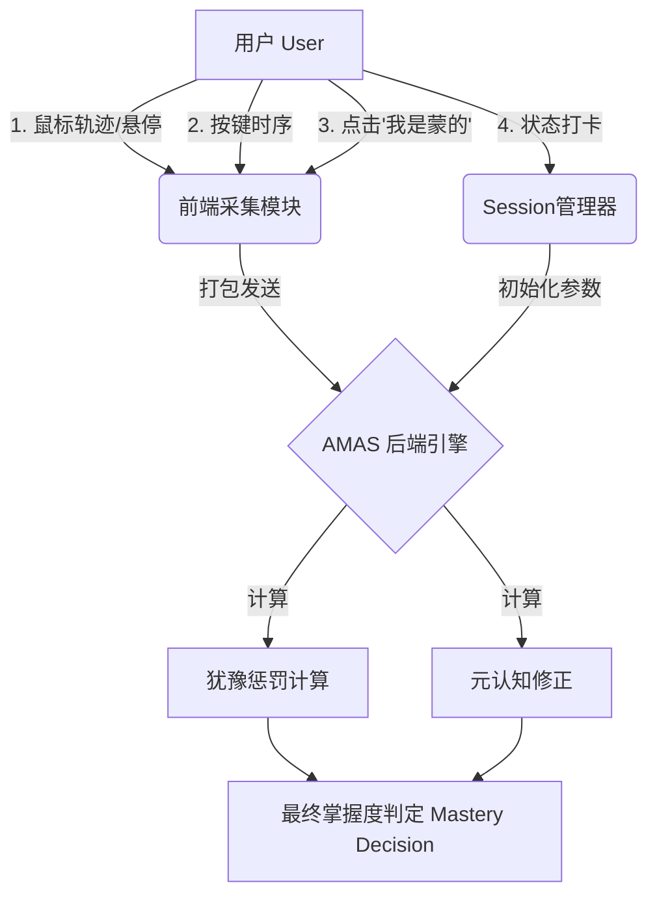

# 智能学习系统数据采集拓展方案 (AMAS Data Expansion Plan)

本文档旨在详述 AMAS 系统的数据采集拓展方向，重点聚焦于 **“微观无感采集”** 与 **“主动元认知交互”**，以进一步提升学习算法的细腻度与精准度。

---

## 策略一：微观行为数据拓展（无感采集）

通过捕捉用户在毫秒级的潜意识操作，挖掘“答对”背后的“确信度”。

### 1. 犹豫系数 (Indecision Index)

**核心逻辑**：用户在做出最终选择前，鼠标或手指的移动轨迹暴露了其思维过程。如果轨迹在错误选项 A 和正确选项 B 之间反复横跳，说明 A 是强干扰项，且用户对 B 的掌握不牢固。

#### 数据采集点

- **Hover Duration (悬停时长)**：记录鼠标在每个选项上的悬停时间（毫秒）。
- **Path Deviation (路径偏离)**：记录鼠标从题目出现到点击最终选项的轨迹长度。如果 `轨迹长度 / 直线距离 > 阈值`，说明有犹豫。
- **Switch Count (犹豫切换)**：手指按下或鼠标悬停在选项 A，但最终松开或点击了选项 B。

#### 前端实现方案 (React)

在 `TestOptions` 组件中引入触摸/鼠标追踪：

```typescript
interface MicroInteraction {
  hoverTimestamps: Record<string, number>; // 选项ID -> 悬停总时长
  trajectoryLength: number; // 鼠标移动总像素距离
  tentativeSelections: string[]; // 曾经按下但未松手/曾经悬停超过500ms的选项
}
```

#### 算法价值

- **惩罚系数**：`MasteryScore = 基础分 * (1.0 - k * 犹豫系数)`。答对但犹豫，得分降低。
- **干扰项优化**：识别出最具迷惑性的错误选项，用于后续生成更难的题目。

### 2. 按键特征 (Keystroke Dynamics)

**核心逻辑**：针对使用键盘快捷键 (1-4) 的用户，按键的时序特征反映了认知加工速度。

#### 数据采集点

- **Reaction Latency (反应潜伏期)**：题目渲染完成 -> 第一次按下按键的时间。
- **Key Hold Time (按键保持时间)**：按下按键 -> 松开按键的时间。极短的保持时间通常代表“肌肉记忆”级的熟练。

#### 算法价值

- **熟练度加权**：极短延迟+极短保持时间 = 高度熟练（Mastery ++）。

---

## 策略二：主动元认知交互（主动采集）

赋予用户与算法直接对话的能力，弥补单纯行为数据的模糊性。

### 1. “蒙题”标记 (Uncertainty Flag)

**产品设计**：
在提交按钮旁（或选项下方）增加一个低调的“不确定/蒙的”复选框，或者设计一个“我没把握”的辅助按钮。

#### 交互流程

1.  用户点击选项。
2.  （可选）在结果结算前，用户如果觉得自己是蒙的，可以点击“标记为不确定”。
3.  系统显示正确答案。

#### 数据模型

后端 `ProcessEventRequest` 增加字段：

```rust
struct AdvancedInteractions {
    pub is_guess: bool, // 用户自述“我是蒙的”
}
```

#### 算法价值

- **一票否决**：如果 `is_guess = true`，即使答对，`is_mastered` 强制设为 `false`。
- **立即复习**：该词会被放入“高优先级复习队列”，在当前 Session 结束前或次日必须再次出现。

### 2. 状态打卡 (State Check-in)

**产品设计**：
每次学习 Session 开始前（或每学习 15 分钟后），弹出一个轻量级的状态询问浮层。

#### 交互选项

- 🤯 **精力充沛** (High Energy) -> 开启“挑战模式”（High Difficulty, High New Ratio）
- 😐 **平平淡淡** (Normal) -> 开启“标准模式”
- 😫 **精疲力尽** (Exhausted) -> 开启“无痛复习模式”（Low Difficulty, Zero New Words）

#### 算法价值

- **AMAS 策略初始化**：直接重写 `StrategyParams` 中的 `difficulty` 和 `new_ratio`。
- **疲劳度校准**：用用户的真实反馈来校准后端的 `FatigueModel`（疲劳模型），让算法越来越准。

---

## 总结：数据流向全景图



通过实施这套拓展方案，系统将从**“判断结果”**进化为**“洞察过程”**，真正成为一名懂你心理活动的 AI 导师。
