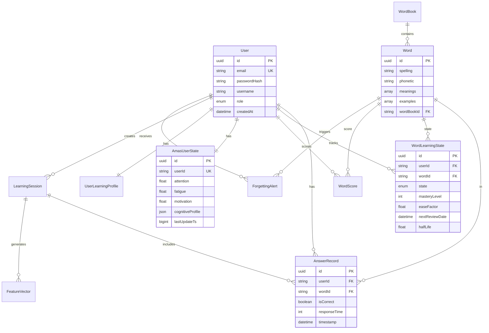

# 架构图集

**项目**: 词汇学习应用 (Danci)
**版本**: v2.0
**更新日期**: 2025-12-13

---

## 目录

1. [当前架构（单体）](#1-当前架构单体)
2. [数据模型关系图](#2-数据模型关系图)
3. [AMAS引擎架构](#3-amas引擎架构)
4. [事件驱动架构](#4-事件驱动架构)
5. [未来演进架构](#5-未来演进架构)
6. [部署架构](#6-部署架构)

---

## 1. 当前架构（单体）

### 1.1 整体架构

```
┌─────────────────────────────────────────────────────────────────┐
│                       Frontend (React + Vite)                   │
│                      http://localhost:5173                      │
└───────────────────────────┬─────────────────────────────────────┘
                            │ HTTPS/REST API
                            │ CORS: http://localhost:5173
                            │
┌───────────────────────────▼─────────────────────────────────────┐
│                    Backend (Express + TypeScript)               │
│                      http://localhost:3000                      │
├─────────────────────────────────────────────────────────────────┤
│                                                                 │
│  ┌─────────────────────────────────────────────────────────┐  │
│  │                  API Layer (Routes)                     │  │
│  │  /api/v1 (新)  /api/* (旧, deprecated 2026-06-30)      │  │
│  └─────────────────────────────────────────────────────────┘  │
│                            │                                    │
│  ┌─────────────────────────▼───────────────────────────────┐  │
│  │                  Service Layer                          │  │
│  │  ┌──────────┐  ┌──────────┐  ┌──────────┐             │  │
│  │  │  Auth    │  │   Word   │  │  Record  │             │  │
│  │  │ Service  │  │ Service  │  │ Service  │             │  │
│  │  └──────────┘  └──────────┘  └──────────┘             │  │
│  │                                                         │  │
│  │  ┌───────────────────────────────────────────────┐    │  │
│  │  │        AMAS Intelligent Engine                │    │  │
│  │  │  ┌──────────┐  ┌──────────┐  ┌──────────┐   │    │  │
│  │  │  │Perception│─>│ Modeling │─>│ Learning │   │    │  │
│  │  │  └──────────┘  └──────────┘  └──────────┘   │    │  │
│  │  │         │            │            │          │    │  │
│  │  │  ┌──────▼────┐  ┌───▼──────┐  ┌─▼────────┐ │    │  │
│  │  │  │ Decision  │─>│Evaluation│─>│Optimize  │ │    │  │
│  │  │  └───────────┘  └──────────┘  └──────────┘ │    │  │
│  │  └───────────────────────────────────────────────┘    │  │
│  │                                                         │  │
│  │  ┌──────────┐  ┌──────────┐  ┌──────────┐             │  │
│  │  │Learning  │  │  User    │  │Notifica- │             │  │
│  │  │ State    │  │ Profile  │  │ tion     │             │  │
│  │  │ Service  │  │ Service  │  │ Service  │             │  │
│  │  └──────────┘  └──────────┘  └──────────┘             │  │
│  └─────────────────────────────────────────────────────────┘  │
│                            │                                    │
│  ┌─────────────────────────▼───────────────────────────────┐  │
│  │              Core Infrastructure                        │  │
│  │  ┌──────────┐  ┌──────────┐  ┌──────────┐             │  │
│  │  │EventBus  │  │  Redis   │  │  Logger  │             │  │
│  │  │(In-Proc) │  │  Cache   │  │  (Pino)  │             │  │
│  │  └──────────┘  └──────────┘  └──────────┘             │  │
│  └─────────────────────────────────────────────────────────┘  │
│                            │                                    │
│  ┌─────────────────────────▼───────────────────────────────┐  │
│  │           Data Access Layer (Prisma ORM)                │  │
│  │  Repository Pattern + Caching (Redis)                   │  │
│  └─────────────────────────────────────────────────────────┘  │
│                            │                                    │
└────────────────────────────┼────────────────────────────────────┘
                             │
         ┌───────────────────┴───────────────────┐
         │                                       │
┌────────▼─────────┐               ┌─────────────▼───────┐
│   PostgreSQL     │               │      Redis          │
│   (Main DB)      │               │   (Cache/Queue)     │
│   42 Tables      │               │   Optional          │
└──────────────────┘               └─────────────────────┘
```

### 1.2 请求流程

```
┌────────┐
│Frontend│
└───┬────┘
    │ 1. POST /api/v1/learning/records
    │    { userId, wordId, isCorrect, ... }
    ▼
┌───────────────────┐
│ Record Controller │
└───────┬───────────┘
        │ 2. Call recordService.saveAnswer()
        ▼
┌───────────────────┐
│  Record Service   │
└───────┬───────────┘
        │ 3. Save to DB + Publish Event
        ▼
┌───────────────────┐         ┌───────────────────┐
│    EventBus       │────────>│ AMAS Service      │
│ (In-Process)      │         │ (Subscribe)       │
└───────────────────┘         └─────────┬─────────┘
                                        │ 4. Process Decision
                                        │ - Update User State
                                        │ - Calculate Reward
                                        │ - Recommend Next Word
                                        ▼
                              ┌─────────────────────┐
                              │ WordSelection       │
                              │ Service             │
                              └─────────┬───────────┘
                                        │ 5. Return next words
                                        ▼
                              ┌─────────────────────┐
                              │ Frontend (SSE)      │
                              │ Real-time Update    │
                              └─────────────────────┘
```

---

## 2. 数据模型关系图

### 2.1 核心领域模型



### 2.2 数据库表分组

```
┌─────────────────────────────────────────────────────────────┐
│                    PostgreSQL Database                      │
├─────────────────────────────────────────────────────────────┤
│                                                             │
│  【用户认证】(2 tables)                                      │
│  ├─ User (用户主表, 关联22个子表)                            │
│  └─ Session (JWT会话令牌)                                   │
│                                                             │
│  【词汇管理】(4 tables)                                      │
│  ├─ WordBook (词书: 系统词书/用户词书)                       │
│  ├─ Word (单词详情: 拼写/音标/释义/例句)                     │
│  ├─ WordContext (语境强化)                                  │
│  └─ word_frequency (词频数据)                               │
│                                                             │
│  【学习状态】(5 tables)                                      │
│  ├─ WordLearningState (单词学习状态: NEW/LEARNING/MASTERED) │
│  ├─ WordScore (单词得分: 准确率/速度/稳定性)                 │
│  ├─ AnswerRecord (答题记录: 正确/响应时间/停留时间)          │
│  ├─ LearningSession (学习会话: 开始时间/结束时间/目标)       │
│  └─ WordReviewTrace (复习轨迹: 时间序列数据)                │
│                                                             │
│  【AMAS算法】(7 tables)                                      │
│  ├─ AmasUserState (用户状态: 注意力/疲劳度/动机)            │
│  ├─ AmasUserModel (用户模型: LinUCB参数)                    │
│  ├─ FeatureVector (特征向量: 多版本)                        │
│  ├─ RewardQueue (延迟奖励队列: 24小时延迟)                  │
│  ├─ DecisionRecord (决策记录: 轨迹追踪)                     │
│  ├─ DecisionInsight (决策洞察: 可解释性)                    │
│  └─ PipelineStage (流水线阶段: 六层架构)                    │
│                                                             │
│  【用户画像】(5 tables)                                      │
│  ├─ UserLearningProfile (学习档案: 认知状态/情绪/心流)      │
│  ├─ HabitProfile (习惯画像: 时间偏好/节奏)                  │
│  ├─ UserStateHistory (状态历史: 7/30/90天趋势)             │
│  ├─ UserStudyConfig (学习配置: 每日目标/词书选择)           │
│  └─ UserPreference (用户偏好: 通知/主题/语言)               │
│                                                             │
│  【评估优化】(8 tables)                                      │
│  ├─ AlgorithmConfig (算法配置: 超参数)                       │
│  ├─ ConfigHistory (配置历史: 审计追踪)                      │
│  ├─ ABExperiment (A/B实验: 流量分配/显著性检验)             │
│  ├─ ABVariant (实验变体: 控制组/实验组)                     │
│  ├─ ABUserAssignment (用户分配: 一致性哈希)                 │
│  ├─ ABExperimentMetrics (实验指标: 均值/方差)               │
│  ├─ BayesianOptimizerState (贝叶斯优化器: 观测历史)         │
│  └─ CausalObservation (因果观测: ITE/ATE估计)              │
│                                                             │
│  【通知告警】(4 tables)                                      │
│  ├─ ForgettingAlert (遗忘预警: 预测遗忘时间/保持率)         │
│  ├─ Notification (通知消息: 成就/提醒/系统)                 │
│  ├─ AnomalyFlag (异常标记: 作弊检测/数据异常)               │
│  └─ LogAlertRule (日志告警规则: 阈值/Webhook)               │
│                                                             │
│  【成就系统】(4 tables)                                      │
│  ├─ BadgeDefinition (徽章定义: 连续学习/准确率)             │
│  ├─ UserBadge (用户徽章: 解锁时间/等级)                     │
│  ├─ LearningPlan (学习计划: 目标/里程碑)                    │
│  ├─ UserLearningObjectives (学习目标: 短期/长期)            │
│  └─ ObjectiveHistory (目标历史: 切换原因/指标)              │
│                                                             │
│  【日志监控】(2 tables)                                      │
│  ├─ SystemLog (系统日志: 结构化日志存储)                    │
│  └─ LogAlertRule (日志告警规则: 已归并到通知告警)           │
│                                                             │
│  【LLM顾问】(1 table)                                        │
│  └─ LLMAdvisorSuggestion (AI建议: 每周学习报告)             │
│                                                             │
└─────────────────────────────────────────────────────────────┘

总计: 42 个表, 600+ 个字段
```

---

## 3. AMAS引擎架构

### 3.1 六层架构

```
┌─────────────────────────────────────────────────────────────┐
│                      AMAS Engine                            │
│            (Adaptive Multi-Armed Bandit System)             │
├─────────────────────────────────────────────────────────────┤
│                                                             │
│  Layer 1: Perception (感知层)                               │
│  ┌────────────────────────────────────────────────────┐   │
│  │ RawEvent → FeatureVector                           │   │
│  │ - 答题事件（正确/错误/响应时间）                      │   │
│  │ - 行为信号（停留时间/上下文切换）                     │   │
│  │ - 时间特征（小时/星期/会话长度）                      │   │
│  └────────────────────────────────────────────────────┘   │
│                        │                                    │
│  Layer 2: Modeling (建模层)                                 │
│  ┌────────────────────┴───────────────────────────────┐   │
│  │ UserState Update                                   │   │
│  │ ├─ AttentionMonitor (注意力监测)                   │   │
│  │ ├─ FatigueEstimator (疲劳估计)                     │   │
│  │ ├─ MotivationTracker (动机追踪)                    │   │
│  │ ├─ CognitiveProfiler (认知能力建模)                │   │
│  │ ├─ FlowDetector (心流检测: 4种状态)                │   │
│  │ ├─ EmotionDetector (情绪识别: 5种情绪)             │   │
│  │ └─ ForgettingCurve (遗忘曲线: 半衰期计算)          │   │
│  └────────────────────────────────────────────────────┘   │
│                        │                                    │
│  Layer 3: Learning (学习层)                                 │
│  ┌────────────────────┴───────────────────────────────┐   │
│  │ Algorithm Selection                                │   │
│  │ ├─ LinUCB (置信上界: 探索/利用平衡)                │   │
│  │ ├─ ThompsonSampling (概率匹配: 贝叶斯采样)         │   │
│  │ ├─ EnsembleLearner (集成学习: 多算法投票)          │   │
│  │ └─ ColdStartStrategy (冷启动: 启发式→LinUCB)       │   │
│  └────────────────────────────────────────────────────┘   │
│                        │                                    │
│  Layer 4: Decision (决策层)                                 │
│  ┌────────────────────┴───────────────────────────────┐   │
│  │ Strategy Selection                                 │   │
│  │ ├─ DifficultyPolicy (难度策略: 简单/中等/困难)     │   │
│  │ ├─ ReviewTimingPolicy (复习时机: 间隔重复)         │   │
│  │ ├─ NewWordPolicy (新词策略: 引入速率)              │   │
│  │ ├─ RestPolicy (休息策略: 疲劳阈值)                 │   │
│  │ └─ ContextPolicy (语境策略: 强化学习)              │   │
│  └────────────────────────────────────────────────────┘   │
│                        │                                    │
│  Layer 5: Evaluation (评估层)                               │
│  ┌────────────────────┴───────────────────────────────┐   │
│  │ Performance Measurement                            │   │
│  │ ├─ ImmediateReward (即时奖励: 正确性+速度+难度)    │   │
│  │ ├─ DelayedReward (延迟奖励: 24小时后保持率)        │   │
│  │ ├─ MasteryEvaluator (掌握度评估: SRS+ACT-R)       │   │
│  │ └─ CausalInference (因果推断: ITE/ATE估计)         │   │
│  └────────────────────────────────────────────────────┘   │
│                        │                                    │
│  Layer 6: Optimization (优化层)                             │
│  ┌────────────────────┴───────────────────────────────┐   │
│  │ Hyperparameter Tuning                              │   │
│  │ ├─ BayesianOptimizer (贝叶斯优化: 高斯过程)        │   │
│  │ ├─ MultiObjectiveOptimizer (多目标优化: Pareto)    │   │
│  │ ├─ ABTesting (A/B测试: 显著性检验)                │   │
│  │ └─ LLMAdvisor (AI顾问: 每周学习建议)               │   │
│  └────────────────────────────────────────────────────┘   │
│                                                             │
└─────────────────────────────────────────────────────────────┘
```

### 3.2 算法决策流程

```
[用户答题事件]
      │
      ▼
┌─────────────────┐
│ 1. 特征提取     │ ← Perception Layer
│ RawEvent →      │
│ FeatureVector   │
└────────┬────────┘
         │
         ▼
┌─────────────────┐
│ 2. 状态更新     │ ← Modeling Layer
│ Attention ↓     │   (注意力下降)
│ Fatigue ↑       │   (疲劳度上升)
│ Motivation →    │   (动机保持)
└────────┬────────┘
         │
         ▼
┌─────────────────┐
│ 3. 策略选择     │ ← Learning Layer
│ IF fatigue>0.7  │
│   THEN RestPol  │
│ ELSE IF new<0.3 │
│   THEN NewWord  │
│ ELSE ReviewPol  │
└────────┬────────┘
         │
         ▼
┌─────────────────┐
│ 4. 难度计算     │ ← Decision Layer
│ Difficulty =    │
│   0.3*error +   │   (历史错误率)
│   0.2*interval+ │   (复习间隔)
│   0.2*halfLife+ │   (遗忘曲线)
│   0.3*userState │   (用户状态)
└────────┬────────┘
         │
         ▼
┌─────────────────┐
│ 5. 单词推荐     │
│ Top-K Words by  │
│ UCB Score       │
└────────┬────────┘
         │
         ▼
┌─────────────────┐
│ 6. 奖励计算     │ ← Evaluation Layer
│ Immediate:      │
│   +1.0 correct  │
│   +0.2 fast     │
│ Delayed:        │
│   +0.5 retain   │   (24小时后)
└────────┬────────┘
         │
         ▼
┌─────────────────┐
│ 7. 模型更新     │
│ LinUCB.update() │
│ θ ← θ + α∇L     │   (梯度下降)
└─────────────────┘
```

---

## 4. 事件驱动架构

### 4.1 EventBus架构

```
┌─────────────────────────────────────────────────────────────┐
│                        EventBus                             │
│                    (In-Process Pub/Sub)                     │
├─────────────────────────────────────────────────────────────┤
│                                                             │
│  Publishers (发布者)          Events (8种)                  │
│  ┌──────────────┐            ┌──────────────────┐         │
│  │RecordService │───────────>│ANSWER_RECORDED   │         │
│  └──────────────┘            └──────────────────┘         │
│                                      │                      │
│  ┌──────────────┐            ┌──────▼──────────┐          │
│  │LearningSession│──────────>│SESSION_STARTED  │          │
│  │   Service    │            └──────────────────┘         │
│  └──────────────┘            ┌──────────────────┐         │
│                   ┌─────────>│SESSION_ENDED    │          │
│  ┌──────────────┐ │          └──────────────────┘         │
│  │MasteryService│─┤          ┌──────────────────┐         │
│  └──────────────┘ └─────────>│WORD_MASTERED    │          │
│                               └──────────────────┘         │
│  ┌──────────────┐            ┌──────────────────┐         │
│  │ForgettingAlert│──────────>│FORGETTING_RISK_ │          │
│  │   Worker     │            │     HIGH        │          │
│  └──────────────┘            └──────────────────┘         │
│                                                             │
│                                      │                      │
│  Subscribers (订阅者)                │                      │
│  ┌──────────────┐            ┌──────▼──────────┐          │
│  │AMAS Service  │<───────────│Event Dispatcher │          │
│  │(核心算法)     │            │(多播分发)        │          │
│  └──────────────┘            └──────┬──────────┘          │
│                                      │                      │
│  ┌──────────────┐                   │                      │
│  │Notification  │<──────────────────┤                      │
│  │  Service     │                   │                      │
│  └──────────────┘                   │                      │
│                                      │                      │
│  ┌──────────────┐                   │                      │
│  │Realtime      │<──────────────────┤                      │
│  │  Service     │                   │                      │
│  │  (SSE推送)   │                   │                      │
│  └──────────────┘                   │                      │
│                                      │                      │
│  ┌──────────────┐                   │                      │
│  │Metrics       │<──────────────────┘                      │
│  │  Service     │                                          │
│  └──────────────┘                                          │
│                                                             │
│  特性:                                                      │
│  ✓ 错误隔离 (一个订阅者失败不影响其他)                       │
│  ✓ 异步处理 (非阻塞)                                        │
│  ✓ 解耦 (发布者无需知道订阅者)                              │
│  ✓ 可扩展 (新增订阅者无需修改发布者)                        │
│                                                             │
└─────────────────────────────────────────────────────────────┘
```

### 4.2 领域事件定义

```typescript
// 8种核心领域事件

1. ANSWER_RECORDED (答题记录)
{
  type: 'ANSWER_RECORDED',
  userId: string,
  wordId: string,
  isCorrect: boolean,
  responseTime: number,
  timestamp: number,
  sessionId: string
}

2. SESSION_STARTED (会话开始)
{
  type: 'SESSION_STARTED',
  userId: string,
  sessionId: string,
  targetMasteryCount: number,
  timestamp: number
}

3. SESSION_ENDED (会话结束)
{
  type: 'SESSION_ENDED',
  userId: string,
  sessionId: string,
  actualMasteryCount: number,
  duration: number,
  timestamp: number
}

4. WORD_MASTERED (单词掌握)
{
  type: 'WORD_MASTERED',
  userId: string,
  wordId: string,
  masteryLevel: number,
  timestamp: number
}

5. FORGETTING_RISK_HIGH (遗忘风险高)
{
  type: 'FORGETTING_RISK_HIGH',
  userId: string,
  wordId: string,
  recallProbability: number,
  predictedForgetAt: Date,
  timestamp: number
}

6. STRATEGY_ADJUSTED (策略调整)
{
  type: 'STRATEGY_ADJUSTED',
  userId: string,
  oldStrategy: string,
  newStrategy: string,
  reason: string,
  timestamp: number
}

7. USER_STATE_UPDATED (用户状态更新)
{
  type: 'USER_STATE_UPDATED',
  userId: string,
  attention: number,
  fatigue: number,
  motivation: number,
  timestamp: number
}

8. REWARD_DISTRIBUTED (奖励分发)
{
  type: 'REWARD_DISTRIBUTED',
  userId: string,
  wordId: string,
  reward: number,
  rewardType: 'immediate' | 'delayed',
  timestamp: number
}
```

---

## 5. 未来演进架构

### 5.1 阶段1：模块化单体（0-6个月）

**当前架构保持不变，强化内部模块边界**

```
┌─────────────────────────────────────────────────────────────┐
│                    Backend Monolith                         │
├─────────────────────────────────────────────────────────────┤
│                                                             │
│  Module 1: User & Auth (用户认证)                           │
│  ├─ Bounded Context: Identity & Access                     │
│  ├─ Aggregate Root: User                                   │
│  └─ Interface: IAuthService, IUserService                   │
│                                                             │
│  Module 2: Vocabulary Management (词汇管理)                 │
│  ├─ Bounded Context: Word Library                          │
│  ├─ Aggregate Root: WordBook, Word                         │
│  └─ Interface: IWordService, IWordBookService               │
│                                                             │
│  Module 3: Learning State Management (学习状态)             │
│  ├─ Bounded Context: Learning Progress                     │
│  ├─ Aggregate Root: WordLearningState                      │
│  └─ Interface: ILearningStateService, IRecordService        │
│                                                             │
│  Module 4: AMAS Intelligent Engine (智能引擎) ⭐             │
│  ├─ Bounded Context: Adaptive Recommendation               │
│  ├─ Aggregate Root: AmasUserState                          │
│  └─ Interface: IAmasService, IDecisionEngine                │
│                                                             │
│  Module 5: User Profile & Preferences (用户画像)            │
│  ├─ Bounded Context: User Profiling                        │
│  ├─ Aggregate Root: UserLearningProfile                    │
│  └─ Interface: IUserProfileService, IHabitService           │
│                                                             │
│  Module 6: Notification & Alert (通知告警)                  │
│  ├─ Bounded Context: User Engagement                       │
│  ├─ Aggregate Root: Notification                           │
│  └─ Interface: INotificationService, IAlertService          │
│                                                             │
│  Module 7: Analytics & Reporting (统计分析)                 │
│  ├─ Bounded Context: Insights & Reports                    │
│  ├─ Interface: IAnalyticsService, IReportService            │
│  └─ Data: Read-Only (CQRS Read Model)                      │
│                                                             │
│  ┌───────────────────────────────────────────────────────┐ │
│  │          Shared Infrastructure                        │ │
│  │  EventBus | Logger | Cache | Monitoring              │ │
│  └───────────────────────────────────────────────────────┘ │
│                                                             │
└─────────────────────────────────────────────────────────────┘
```

**关键改进**:

- ✅ 接口抽象（便于未来拆分）
- ✅ 依赖注入（解耦实现）
- ✅ 限界上下文清晰
- ✅ 聚合根明确

### 5.2 阶段2：边界服务提取（6-12个月）

**提取低耦合服务，共享数据库 → 独立数据库**

```
┌──────────────────────────────────────────────────────────┐
│              Core Monolith Backend                       │
│  (User/Word/Learning/AMAS)                               │
│  - 40个表 (User, Word, AnswerRecord, AmasUserState等)   │
└────────────────────┬─────────────────────────────────────┘
                     │
                     │ Publish Domain Events
                     │
         ┌───────────▼──────────┐
         │    Redis Pub/Sub     │
         │  (Message Queue)     │
         └───────────┬──────────┘
                     │
        ┌────────────┴───────────────┐
        │                            │
┌───────▼────────────┐      ┌────────▼────────────┐
│ Notification       │      │  Analytics          │
│ Service            │      │  Service (RO)       │
│ (独立部署)          │      │  (只读查询)          │
├────────────────────┤      ├─────────────────────┤
│ - ForgettingAlert  │      │ - 无独立表          │
│ - Notification     │      │ - 连接只读副本       │
│ - SSE管理          │      │ - 统计聚合查询       │
└────────┬───────────┘      └─────────┬───────────┘
         │                            │
         │                            │
┌────────▼────────┐         ┌─────────▼──────────┐
│  PostgreSQL     │         │  PostgreSQL        │
│  (Notification  │         │  Read Replica      │
│   Database)     │         │  (延迟<5秒)        │
└─────────────────┘         └────────────────────┘
```

**迁移步骤**:

**通知服务拆分**:

1. 代码复制（共享数据库）
2. 独立部署（进程隔离）
3. 切换EventBus（Redis Pub/Sub）
4. 数据库表迁移（Database per Service）

**统计服务拆分**:

1. 启用PostgreSQL只读副本
2. 部署Analytics Service（连接副本）
3. 使用CQRS读模型

### 5.3 阶段3：评估核心拆分（12-24个月）

**仅在业务规模足够大时考虑**

```
                    ┌─────────────────┐
                    │   API Gateway   │
                    │   (Kong/Nginx)  │
                    └────────┬────────┘
                             │
         ┌───────────────────┼───────────────────┐
         │                   │                   │
┌────────▼────────┐ ┌────────▼────────┐ ┌───────▼────────┐
│  Auth Service   │ │  Core Monolith  │ │ Notification   │
│  (Auth0/SSO)    │ │  (AMAS+Learning)│ │ Service        │
└────────┬────────┘ └────────┬────────┘ └───────┬────────┘
         │                   │                   │
┌────────▼────────┐ ┌────────▼────────┐ ┌───────▼────────┐
│  User DB        │ │  Core DB        │ │ Notification   │
│  (Auth0 Cloud)  │ │  (PostgreSQL)   │ │ DB             │
└─────────────────┘ └─────────────────┘ └────────────────┘
```

**前提条件** (ALL必须满足):

- ✅ 用户量 > 100,000 DAU
- ✅ 团队规模 > 10人（多小组）
- ✅ 数据库QPS > 10,000
- ✅ 边界服务稳定运行 > 12个月
- ✅ DevOps成熟（CI/CD, 服务发现, 分布式追踪）

**不推荐拆分**:

- ❌ AMAS引擎 + 学习状态（强耦合）
- ❌ 任何需要分布式事务的模块

---

## 6. 部署架构

### 6.1 当前部署（单节点）

```
┌─────────────────────────────────────────────────────────────┐
│                    Physical/Virtual Server                  │
│                    (Ubuntu 20.04 LTS)                       │
├─────────────────────────────────────────────────────────────┤
│                                                             │
│  ┌─────────────────────────────────────────────────────┐  │
│  │                  Node.js Process                    │  │
│  │                  (PM2 Managed)                      │  │
│  │                                                     │  │
│  │  ┌───────────────────────────────────────────┐    │  │
│  │  │        Backend Application                │    │  │
│  │  │  - Express Server (Port 3000)             │    │  │
│  │  │  - AMAS Engine (In-Process)               │    │  │
│  │  │  - EventBus (In-Memory)                   │    │  │
│  │  │  - Workers (Cron Jobs)                    │    │  │
│  │  └───────────────────────────────────────────┘    │  │
│  │                                                     │  │
│  └─────────────────────────────────────────────────────┘  │
│                                                             │
│  ┌─────────────────────────────────────────────────────┐  │
│  │              PostgreSQL 14                          │  │
│  │              (Port 5432)                            │  │
│  │              Data: /var/lib/postgresql/14/main      │  │
│  └─────────────────────────────────────────────────────┘  │
│                                                             │
│  ┌─────────────────────────────────────────────────────┐  │
│  │              Redis 6 (Optional)                     │  │
│  │              (Port 6379)                            │  │
│  │              Cache + Pub/Sub                        │  │
│  └─────────────────────────────────────────────────────┘  │
│                                                             │
│  ┌─────────────────────────────────────────────────────┐  │
│  │              Nginx (Reverse Proxy)                  │  │
│  │              (Port 80/443)                          │  │
│  │              SSL: Let's Encrypt                     │  │
│  └─────────────────────────────────────────────────────┘  │
│                                                             │
└─────────────────────────────────────────────────────────────┘

优点:
✓ 简单易维护
✓ 无网络延迟
✓ 事务一致性天然保证
✓ 成本低 ($50-100/月)

缺点:
⚠️ 单点故障
⚠️ 扩展性受限
⚠️ 资源隔离差
```

### 6.2 高可用部署（双节点主从）

```
┌─────────────────────────────────────────────────────────────┐
│                    Load Balancer                            │
│                    (Nginx/HAProxy)                          │
│                    Health Check: /health                    │
└──────────────────────┬──────────────────────────────────────┘
                       │
          ┌────────────┴────────────┐
          │                         │
┌─────────▼──────────┐    ┌─────────▼──────────┐
│  App Server 1      │    │  App Server 2      │
│  (WORKER_LEADER)   │    │  (Follower)        │
│  - API             │    │  - API             │
│  - Workers ✓       │    │  - Workers ✗       │
└─────────┬──────────┘    └─────────┬──────────┘
          │                         │
          └────────────┬────────────┘
                       │
         ┌─────────────▼─────────────┐
         │    PostgreSQL Master      │
         │    (Read/Write)           │
         └─────────────┬─────────────┘
                       │ Replication
         ┌─────────────▼─────────────┐
         │    PostgreSQL Replica     │
         │    (Read-Only)            │
         └───────────────────────────┘

特点:
✓ 高可用 (一台宕机不影响)
✓ 负载均衡 (分散请求)
✓ 读写分离 (查询用副本)
⚠️ Worker单点 (仅主节点运行)
⚠️ 成本增加 ($200-400/月)
```

### 6.3 未来微服务部署（Kubernetes）

```
┌─────────────────────────────────────────────────────────────┐
│                    Kubernetes Cluster                       │
├─────────────────────────────────────────────────────────────┤
│                                                             │
│  Namespace: production                                      │
│                                                             │
│  ┌─────────────────────────────────────────────────────┐  │
│  │              Ingress Controller                     │  │
│  │              (Nginx/Traefik)                        │  │
│  │              SSL: cert-manager                      │  │
│  └────────────────────┬────────────────────────────────┘  │
│                       │                                    │
│          ┌────────────┼────────────┐                      │
│          │            │            │                       │
│  ┌───────▼──────┐ ┌──▼────────┐ ┌▼───────────┐          │
│  │ Core Service │ │Notification│ │Analytics   │          │
│  │ (3 Pods)     │ │(2 Pods)    │ │(2 Pods)    │          │
│  └───────┬──────┘ └──┬─────────┘ └┬───────────┘          │
│          │           │            │                        │
│  ┌───────▼──────┐ ┌──▼─────────┐ ┌▼───────────┐          │
│  │PostgreSQL    │ │PostgreSQL  │ │PostgreSQL  │          │
│  │StatefulSet   │ │StatefulSet │ │(Read Only) │          │
│  │(PVC 100GB)   │ │(PVC 10GB)  │ │            │          │
│  └──────────────┘ └────────────┘ └────────────┘          │
│                                                             │
│  ┌─────────────────────────────────────────────────────┐  │
│  │              Redis Cluster                          │  │
│  │              (3 Masters + 3 Replicas)               │  │
│  └─────────────────────────────────────────────────────┘  │
│                                                             │
│  ┌─────────────────────────────────────────────────────┐  │
│  │              Monitoring Stack                       │  │
│  │  - Prometheus (Metrics)                             │  │
│  │  - Grafana (Dashboard)                              │  │
│  │  - Jaeger (Tracing)                                 │  │
│  │  - ELK (Logs)                                       │  │
│  └─────────────────────────────────────────────────────┘  │
│                                                             │
└─────────────────────────────────────────────────────────────┘

特点:
✓ 自动扩缩容 (HPA)
✓ 自愈能力 (Pod重启)
✓ 滚动更新 (零停机)
✓ 服务发现 (DNS)
✓ 配置管理 (ConfigMap/Secret)

⚠️ 复杂度极高
⚠️ 运维成本 $1000+/月
⚠️ 需要专职DevOps
```

---

## 附录

### A. 技术栈总览

```
Frontend:
├─ React 18
├─ Vite 4
├─ TypeScript 5
├─ TailwindCSS
└─ React Router

Backend:
├─ Node.js 20
├─ Express 4
├─ TypeScript 5
├─ Prisma 5 (ORM)
└─ Zod (Validation)

Database:
├─ PostgreSQL 14 (Main DB)
└─ Redis 6 (Cache/Queue, Optional)

Monitoring:
├─ Pino (Structured Logging)
├─ Sentry (Error Tracking)
└─ Prometheus (Metrics)

DevOps:
├─ PM2 (Process Manager)
├─ Nginx (Reverse Proxy)
├─ Docker (Containerization)
└─ GitHub Actions (CI/CD)
```

### B. 性能指标

```
Latency (P99):
├─ API Response: < 200ms
├─ AMAS Decision: < 100ms
├─ Database Query: < 50ms
└─ Cache Hit: < 5ms

Throughput:
├─ QPS: 1,000-2,000
├─ Concurrent Users: 100-500
└─ Database Connections: 20 (pool)

Resource:
├─ Memory: 500MB (avg), 1GB (peak)
├─ CPU: 10-30% (avg), 60% (peak)
└─ Disk: 10GB (DB), 1GB (logs/month)
```

### C. 扩展性评估

```
当前架构支持:
├─ 用户量: 10,000 - 100,000 DAU
├─ 数据量: 1M - 10M records
├─ 请求量: 100K - 1M requests/day
└─ 团队规模: 1-5 人

瓶颈预测:
├─ 数据库QPS: 10,000+ (需要分片)
├─ 内存占用: 2GB+ (需要分布式缓存)
├─ 日志存储: 100GB+/月 (需要ELK)
└─ 团队协作: 10+ 人 (考虑微服务)
```

---

**文档维护**: 架构图需随代码变更同步更新
**审核周期**: 每季度审查一次架构演进路径
**责任人**: 技术负责人 + 架构师
