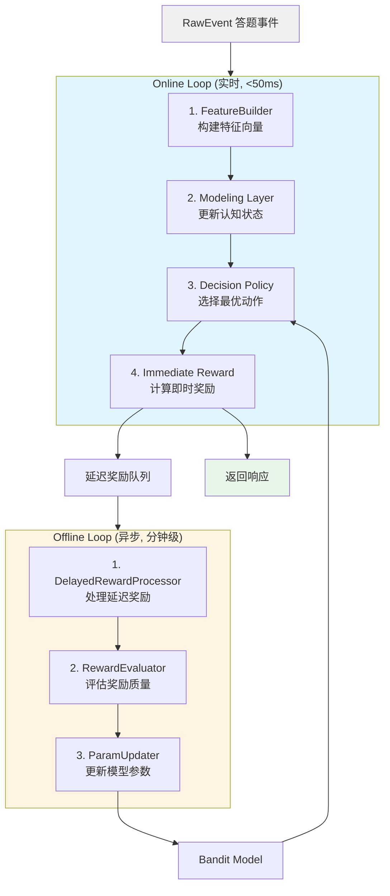
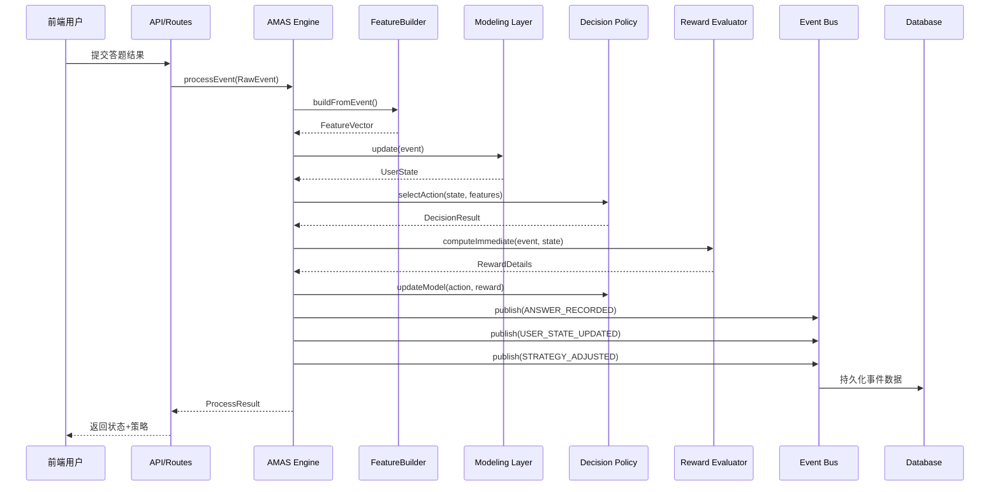
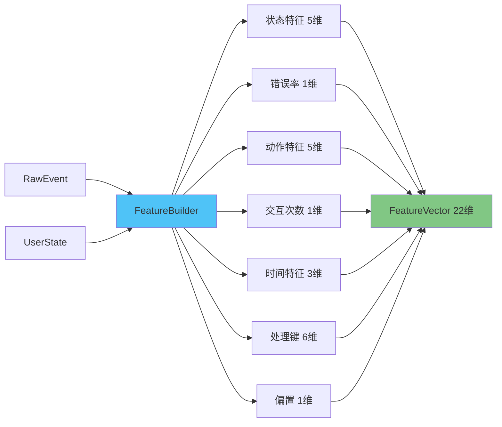
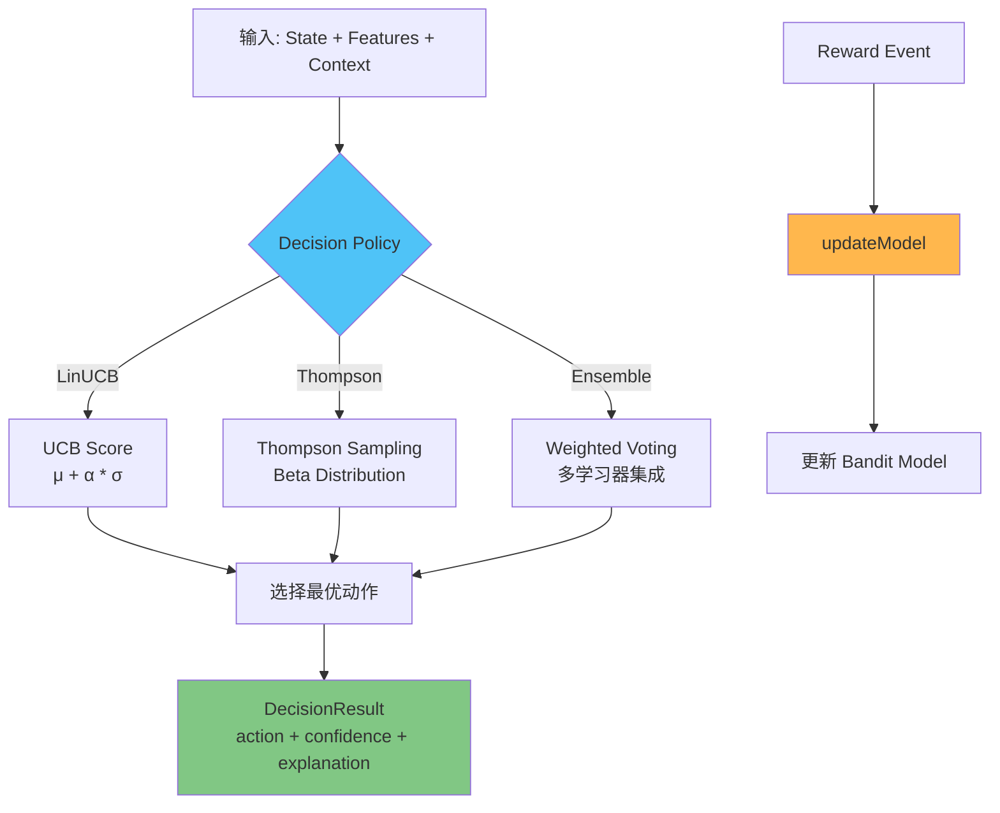
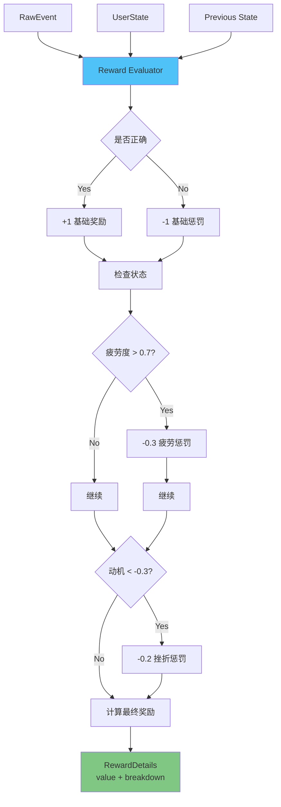
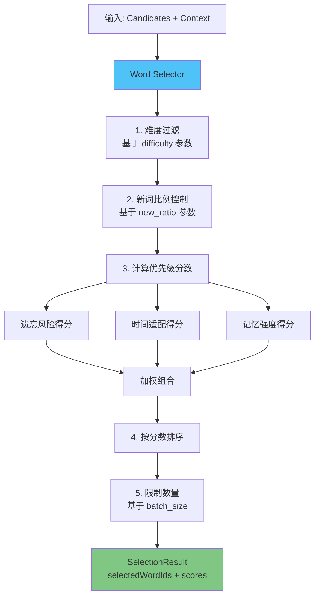
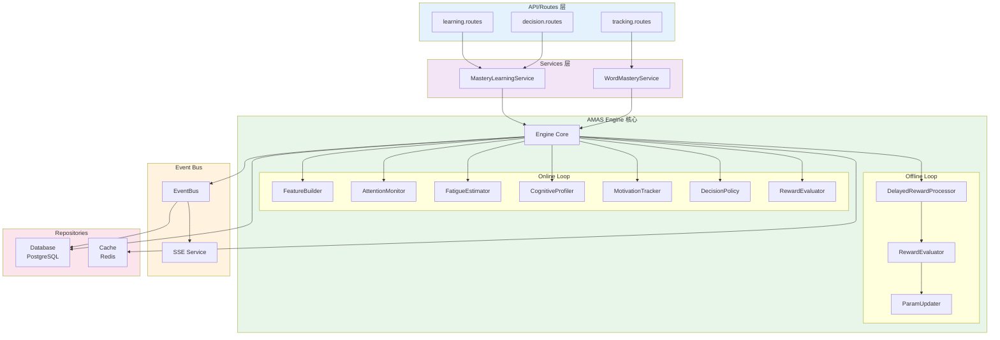
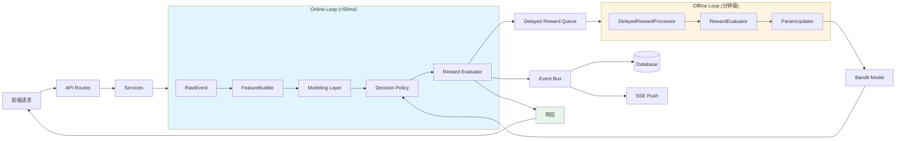

# AMAS 接口契约文档 v1.0

> **版本**: v1.0
> **最后更新**: 2025-12-12
> **状态**: 正式版 (Production)

## 目录

- [1. 概述](#1-概述)
- [2. 架构分层与数据流](#2-架构分层与数据流)
- [3. 核心类型定义](#3-核心类型定义)
- [4. 四大核心接口](#4-四大核心接口)
- [5. 事件系统](#5-事件系统)
- [6. 配置系统](#6-配置系统)
- [7. 依赖关系图](#7-依赖关系图)
- [8. 使用示例](#8-使用示例)
- [9. 版本变更记录](#9-版本变更记录)

---

## 1. 概述

### 1.1 系统简介

AMAS (Adaptive Multi-dimensional Aware System) 是一个自适应多维度用户感知智能学习算法系统。通过实时感知用户状态（注意力、疲劳度、认知能力、动机），动态调整学习策略参数，实现个性化学习体验。

### 1.2 核心特性

- **多维状态建模**: 注意力(A)、疲劳度(F)、认知能力(C)、动机(M)
- **自适应策略学习**: LinUCB/Thompson Sampling/Ensemble 多臂老虎机算法
- **实时+离线双循环**: Online Loop (<50ms) + Offline Loop (分钟级延迟奖励)
- **冷启动优化**: 分类-探索-正常的三阶段冷启动策略
- **多目标优化**: 支持短期记忆、长期记忆、效率的多目标平衡

### 1.3 技术栈

- **语言**: TypeScript (Node.js)
- **数据库**: PostgreSQL (Prisma ORM)
- **缓存**: Redis (可选)
- **实时通信**: Server-Sent Events (SSE)
- **高性能计算**: Native C++ 模块 (可选)

---

## 2. 架构分层与数据流

### 2.1 整体架构

```
┌─────────────────────────────────────────────────────────────┐
│                      API/Routes 层                           │
│  ┌──────────┐  ┌──────────┐  ┌──────────┐  ┌──────────┐   │
│  │ 学习路由  │  │ 答题路由  │  │ 决策路由  │  │ 管理路由  │   │
│  └──────────┘  └──────────┘  └──────────┘  └──────────┘   │
└───────────────────────────┬─────────────────────────────────┘
                            │
┌───────────────────────────▼─────────────────────────────────┐
│                      Services 层                             │
│  ┌──────────────────┐  ┌──────────────────┐                │
│  │ MasteryLearning  │  │ WordMastery      │                │
│  │ Service          │  │ Service          │  ...           │
│  └────────┬─────────┘  └──────────────────┘                │
└───────────┼──────────────────────────────────────────────────┘
            │
┌───────────▼──────────────────────────────────────────────────┐
│                     AMAS Core 双循环                          │
│  ┌─────────────────────────────────────────────────────┐    │
│  │             Online Loop (实时, <50ms)               │    │
│  │  FeatureBuilder → Modeling → Decision → Reward      │    │
│  │  RawEvent → Features → UserState → Action           │    │
│  └─────────────────────────────────────────────────────┘    │
│  ┌─────────────────────────────────────────────────────┐    │
│  │            Offline Loop (异步, 分钟级)              │    │
│  │  DelayedReward → RewardEvaluator → ParamUpdater     │    │
│  │  延迟奖励聚合 → 质量评估 → 模型更新                  │    │
│  └─────────────────────────────────────────────────────┘    │
└──────────────────────────────────────────────────────────────┘
            │
┌───────────▼──────────────────────────────────────────────────┐
│                     事件系统 (EventBus)                       │
│  - 答题记录 (ANSWER_RECORDED)                                │
│  - 策略调整 (STRATEGY_ADJUSTED)                              │
│  - 用户状态更新 (USER_STATE_UPDATED)                         │
│  - 单词掌握 (WORD_MASTERED)                                  │
└──────────────────────────────────────────────────────────────┘
            │
┌───────────▼──────────────────────────────────────────────────┐
│                  持久化层 (Repositories)                      │
│  ┌──────────────┐  ┌──────────────┐  ┌──────────────┐      │
│  │ UserState    │  │ BanditModel  │  │ DecisionLog  │      │
│  │ Repository   │  │ Repository   │  │ Repository   │      │
│  └──────────────┘  └──────────────┘  └──────────────┘      │
└──────────────────────────────────────────────────────────────┘
```

### 2.2 双循环架构



### 2.3 数据流转图



---

## 3. 核心类型定义

### 3.1 用户状态 (UserState)

**位置**: `packages/backend/src/amas/types.ts`

```typescript
/**
 * 用户状态向量 - AMAS核心状态（后端格式）
 *
 * 注意: 字段使用简写名称用于内部处理,
 * API 响应通过 state-converter.ts 转换为前端格式
 */
export interface UserState {
  /** 注意力 [0,1] - 0=完全分心, 1=高度专注 - 前端字段: attention */
  A: number;

  /** 疲劳度 [0,1] - 0=精力充沛, 1=极度疲劳 - 前端字段: fatigue */
  F: number;

  /** 认知能力画像 - 前端字段: cognitive, memory, speed, stability */
  C: CognitiveProfile;

  /** 动机 [-1,1] - -1=极度受挫, 1=高度积极 - 前端字段: motivation */
  M: number;

  /** 学习习惯画像 (可选) */
  H?: HabitProfile;

  /** 长期趋势 (可选) */
  T?: TrendState;

  /** 状态置信度 [0,1] - 前端字段: confidence */
  conf: number;

  /** 时间戳 - 前端字段: timestamp */
  ts: number;
}

/**
 * 认知能力画像
 */
export interface CognitiveProfile {
  /** 记忆力 [0,1] - 基于正确率的EMA */
  mem: number;

  /** 速度 [0,1] - 归一化的反应速度 */
  speed: number;

  /** 稳定性 [0,1] - 1 - 归一化错误率方差 */
  stability: number;
}
```

**字段映射关系**:

| 后端字段      | 前端字段     | 说明   |
| ------------- | ------------ | ------ |
| `A`           | `attention`  | 注意力 |
| `F`           | `fatigue`    | 疲劳度 |
| `M`           | `motivation` | 动机   |
| `C.mem`       | `memory`     | 记忆力 |
| `C.speed`     | `speed`      | 速度   |
| `C.stability` | `stability`  | 稳定性 |
| `conf`        | `confidence` | 置信度 |
| `ts`          | `timestamp`  | 时间戳 |

### 3.2 动作与策略参数 (Action / StrategyParams)

**位置**: `packages/backend/src/amas/types.ts`

```typescript
/**
 * Bandit动作 - 学习层输出
 *
 * 在 v1.0 版本中，Action 和 StrategyParams 结构完全相同
 */
export interface Action {
  /** 间隔缩放因子: 0.5 | 0.8 | 1.0 | 1.2 | 1.5 */
  interval_scale: number;

  /** 新词比例: 0.1 | 0.2 | 0.3 | 0.4 */
  new_ratio: number;

  /** 难度等级 */
  difficulty: DifficultyLevel; // 'easy' | 'mid' | 'hard'

  /** 批量大小: 5 | 8 | 12 | 16 */
  batch_size: number;

  /** 提示级别: 0 | 1 | 2 */
  hint_level: number;
}

/**
 * 策略参数 - 决策层输出
 */
export interface StrategyParams {
  interval_scale: number;
  new_ratio: number;
  difficulty: DifficultyLevel;
  batch_size: number;
  hint_level: number;
}
```

**动作空间**: 预定义 24 个动作组合，覆盖不同的学习场景

**配置位置**: `packages/backend/src/amas/config/action-space.ts`

### 3.3 原始事件 (RawEvent)

**位置**: `packages/backend/src/amas/types.ts`

```typescript
/**
 * 原始学习事件
 */
export interface RawEvent {
  /** 单词ID */
  wordId: string;

  /** 是否正确 */
  isCorrect: boolean;

  /** 反应时间(ms) */
  responseTime: number;

  /** 停留时长(ms) */
  dwellTime: number;

  /** 事件时间戳 */
  timestamp: number;

  /** 暂停次数 - 用户主动暂停的次数 */
  pauseCount: number;

  /** 切屏次数 - 浏览器标签页切换次数 */
  switchCount: number;

  /** 重试次数 - 用户重新尝试的次数 */
  retryCount: number;

  /** 失焦累计时长(ms) - 浏览器失去焦点的总时长 */
  focusLossDuration: number;

  /** 微交互密度(events/s) - 鼠标移动、点击等微交互的频率 */
  interactionDensity: number;

  /** 对话框暂停时间(ms) - 用于疲劳度计算时排除非学习时间 */
  pausedTimeMs?: number;
}
```

### 3.4 特征向量 (FeatureVector)

**位置**: `packages/backend/src/amas/types.ts`

```typescript
/**
 * 特征向量 - 感知层输出
 */
export interface FeatureVector {
  /** 特征值数组 (Float32Array优化性能) */
  values: Float32Array;

  /** 时间戳 */
  ts: number;

  /** 特征标签(用于解释) */
  labels: string[];
}

/**
 * 可序列化的特征向量 - 用于持久化和延迟奖励
 */
export interface PersistableFeatureVector {
  /** 特征值数组 (普通数组，便于JSON序列化) */
  values: number[];

  /** 特征版本号 */
  version: number;

  /** 归一化方法 */
  normMethod?: string;

  /** 时间戳 */
  ts: number;

  /** 特征标签 */
  labels: string[];
}
```

**特征维度**: v2 = 22 维

- 状态特征: 5 维 (A, F, M, C.mem, C.speed)
- 错误率: 1 维
- 动作特征: 5 维 (interval_scale, new_ratio, difficulty, batch_size, hint_level)
- 交互次数: 1 维
- 时间特征: 3 维 (hour, is_weekend, time_bucket)
- 处理键特征: 6 维 (正确+疲劳组合)
- 偏置项: 1 维

---

## 4. 四大核心接口

### 4.1 IFeatureBuilder (特征构建接口)

**位置**: `packages/backend/src/amas/interfaces/index.ts`

**职责**: 从原始事件构建标准化特征向量

```typescript
export interface IFeatureBuilder {
  /**
   * 从单个事件构建特征向量
   *
   * @param event 原始学习事件
   * @param userState 用户当前状态
   * @param userId 用户ID（用于维护用户专属统计窗口）
   * @returns 特征向量（数值数组）
   */
  buildFromEvent(event: RawEvent, userState: UserState, userId: string): number[];

  /**
   * 从历史事件序列构建特征向量
   *
   * @param events 历史事件列表
   * @param userState 用户当前状态
   * @param userId 用户ID
   * @returns 特征向量（数值数组）
   */
  buildFromHistory(events: RawEvent[], userState: UserState, userId: string): number[];

  /**
   * 获取特征维度
   */
  getFeatureDimension(): number;
}
```

**实现示例**: `packages/backend/src/amas/perception/feature-builder.ts`

**特征构建流程**:



**输入/输出**:

| 层级     | 输入                              | 输出                       |
| -------- | --------------------------------- | -------------------------- |
| **输入** | `RawEvent`, `UserState`, `userId` | -                          |
| **输出** | -                                 | `number[]` (22 维特征向量) |

### 4.2 IDecisionPolicy (决策策略接口)

**位置**: `packages/backend/src/amas/interfaces/index.ts`

**职责**: 选择最优学习策略参数

```typescript
/**
 * 决策上下文
 */
export interface DecisionContext {
  /** 近期错误率 [0,1] */
  recentErrorRate: number;

  /** 近期平均反应时间(ms) */
  recentResponseTime: number;

  /** 时间段 (0-23小时) */
  timeBucket: number;

  /** 用户ID（用于用户隔离） */
  userId: string;

  /** 交互次数 */
  interactionCount?: number;
}

/**
 * 决策结果
 */
export interface DecisionResult {
  /** 选择的动作（包含策略参数） */
  action: Action;

  /** 决策置信度 [0,1] */
  confidence: number;

  /** 决策解释 */
  explanation: string;

  /** 决策评分（用于集成学习） */
  score?: number;

  /** 额外元数据 */
  meta?: Record<string, unknown>;
}

/**
 * 决策策略接口
 */
export interface IDecisionPolicy {
  /**
   * 选择最优动作
   *
   * @param state 用户状态
   * @param actions 可选动作列表
   * @param features 特征向量
   * @param context 决策上下文
   * @returns 决策结果
   */
  selectAction(
    state: UserState,
    actions: Action[],
    features: number[],
    context: DecisionContext,
  ): DecisionResult;

  /**
   * 更新模型
   *
   * @param action 执行的动作
   * @param reward 奖励值 [-1, 1]
   * @param features 特征向量
   * @param context 决策上下文
   */
  updateModel(action: Action, reward: number, features: number[], context: DecisionContext): void;

  /**
   * 获取策略名称
   */
  getName(): string;

  /**
   * 获取策略版本
   */
  getVersion(): string;
}
```

**实现示例**:

- `packages/backend/src/amas/adapters/linucb-adapter.ts` - LinUCB 适配器
- `packages/backend/src/amas/adapters/ensemble-adapter.ts` - Ensemble 适配器
- `packages/backend/src/amas/adapters/thompson-adapter.ts` - Thompson Sampling 适配器

**输入/输出**:

| 方法           | 输入                                                   | 输出             |
| -------------- | ------------------------------------------------------ | ---------------- |
| `selectAction` | `UserState`, `Action[]`, `number[]`, `DecisionContext` | `DecisionResult` |
| `updateModel`  | `Action`, `number`, `number[]`, `DecisionContext`      | `void`           |

**决策流程**:



### 4.3 IRewardEvaluator (奖励评估接口)

**位置**: `packages/backend/src/amas/interfaces/index.ts`

**职责**: 计算即时奖励值，指导策略学习

```typescript
/**
 * 奖励详情
 */
export interface RewardDetails {
  /** 总奖励值 [-1, 1] */
  value: number;

  /** 奖励来源说明 */
  reason: string;

  /** 时间戳 */
  timestamp: number;

  /** 分项奖励 */
  breakdown?: {
    correctness?: number;
    fatigue?: number;
    speed?: number;
    frustration?: number;
    engagement?: number;
  };
}

/**
 * 奖励评估器接口
 */
export interface IRewardEvaluator {
  /**
   * 计算即时奖励
   *
   * @param event 原始事件
   * @param state 用户状态
   * @param previousState 先前的用户状态（可选，用于计算状态变化）
   * @returns 奖励详情
   */
  computeImmediate(event: RawEvent, state: UserState, previousState?: UserState): RewardDetails;

  /**
   * 设置奖励配置文件
   *
   * @param profileId 配置文件ID（如 'standard', 'cram', 'relaxed'）
   */
  setRewardProfile?(profileId: string): void;
}
```

**实现示例**: `packages/backend/src/amas/rewards/immediate-reward.ts`

**奖励计算公式**:

```
reward = w1 * correctness
       - w2 * fatigue_penalty
       - w3 * frustration_penalty
       + w4 * engagement_bonus

其中:
- correctness: 正确为 +1, 错误为 -1
- fatigue_penalty: 基于疲劳度的惩罚 (F > 0.7 时激活)
- frustration_penalty: 基于动机下降的惩罚 (M < -0.3 时激活)
- engagement_bonus: 基于注意力和交互质量的奖励
```

**输入/输出**:

| 层级     | 输入                                  | 输出            |
| -------- | ------------------------------------- | --------------- |
| **输入** | `RawEvent`, `UserState`, `UserState?` | -               |
| **输出** | -                                     | `RewardDetails` |

**奖励评估流程**:



### 4.4 IWordSelector (选词策略接口)

**位置**: `packages/backend/src/amas/policies/word-selector.interface.ts`

**职责**: 基于策略参数选择具体单词

```typescript
/**
 * 单词候选项（输入）
 */
export interface WordCandidate {
  /** 单词ID */
  wordId: string;

  /** 单词长度（字符数） */
  length?: number;

  /** 难度等级 */
  difficulty?: 'easy' | 'mid' | 'hard';

  /** 遗忘风险 [0,1]，越高越容易遗忘 */
  forgettingRisk?: number;

  /** 最后复习时间（毫秒时间戳） */
  lastReviewTime?: number;

  /** 复习次数 */
  reviewCount?: number;

  /** 记忆强度 [0,1] */
  memoryStrength?: number;

  /** 优先级分数（可选，用于预先计算的优先级） */
  priorityScore?: number;
}

/**
 * 选词上下文（环境信息）
 */
export interface SelectionContext {
  /** 用户ID */
  userId: string;

  /** 可用时间（分钟） */
  availableTimeMinutes?: number;

  /** 是否为碎片时间场景 */
  isMicroSession?: boolean;

  /** 目标单词数量 */
  targetCount?: number;

  /** 当前时间戳 */
  timestamp?: number;

  /** 用户当前疲劳度 [0,1] */
  fatigue?: number;

  /** 用户当前注意力 [0,1] */
  attention?: number;
}

/**
 * 选词结果
 */
export interface SelectionResult {
  /** 选中的单词ID列表（按优先级排序） */
  selectedWordIds: string[];

  /** 选词理由说明 */
  reason?: string;

  /** 每个单词的优先级分数（可选） */
  scores?: Map<string, number>;
}

/**
 * 单词选择器接口
 */
export interface IWordSelector {
  /**
   * 选择单词
   *
   * @param candidates 候选单词列表
   * @param context 选词上下文
   * @returns 选词结果
   */
  selectWords(
    candidates: WordCandidate[],
    context: SelectionContext,
  ): Promise<SelectionResult> | SelectionResult;

  /**
   * 策略名称（用于日志和调试）
   */
  getName(): string;
}
```

**实现示例**: `packages/backend/src/amas/policies/micro-session-policy.ts`

**选词流程**:



**输入/输出**:

| 层级     | 输入                                  | 输出              |
| -------- | ------------------------------------- | ----------------- |
| **输入** | `WordCandidate[]`, `SelectionContext` | -                 |
| **输出** | -                                     | `SelectionResult` |

---

## 5. 事件系统

### 5.1 事件总线架构

**位置**: `packages/backend/src/core/event-bus.ts`

```
┌────────────────────────────────────────────────────────────┐
│                    EventBus (事件总线)                      │
│                                                             │
│  ┌─────────────────┐  ┌──────────────┐  ┌──────────────┐ │
│  │ 进程内发布/订阅 │  │ SSE 实时推送 │  │ Redis 跨进程 │ │
│  │  (EventEmitter) │  │ (Decision    │  │  (Pub/Sub)   │ │
│  │                 │  │  Events)     │  │              │ │
│  └─────────────────┘  └──────────────┘  └──────────────┘ │
└────────────────────────────────────────────────────────────┘
```

### 5.2 核心事件类型

#### ANSWER_RECORDED (答题记录)

```typescript
export interface AnswerRecordedPayload {
  userId: string;
  wordId: string;
  sessionId: string;
  isCorrect: boolean;
  responseTime: number;
  dwellTime: number;
  masteryLevelBefore: number;
  masteryLevelAfter: number;
  timestamp: Date;
}
```

**触发时机**: 用户完成单词答题时

**订阅者**:

- WordMasteryService (更新单词掌握度)
- StateHistoryService (记录状态历史)
- TrackingService (跟踪学习进度)

#### USER_STATE_UPDATED (用户状态更新)

```typescript
export interface UserStateUpdatedPayload {
  userId: string;
  sessionId?: string;
  previousState: UserState;
  currentState: UserState;
  trigger: 'answer' | 'session_start' | 'manual';
  timestamp: Date;
}
```

**触发时机**: 用户状态发生变化时

**订阅者**:

- StateHistoryService (记录状态历史)
- AlertEngine (检查阈值预警)
- SSE (实时推送到前端)

#### STRATEGY_ADJUSTED (策略调整)

```typescript
export interface StrategyAdjustedPayload {
  userId: string;
  sessionId?: string;
  previousStrategy: StrategyParams;
  newStrategy: StrategyParams;
  userState: UserState;
  reason: string;
  confidence: number;
  timestamp: Date;
}
```

**触发时机**: 决策策略调整时

**订阅者**:

- DecisionRecorderService (记录决策日志)
- MonitoringService (监控策略效果)
- SSE (实时推送策略变化)

#### WORD_MASTERED (单词掌握)

```typescript
export interface WordMasteredPayload {
  userId: string;
  wordId: string;
  masteryLevel: number;
  evaluationScore: number;
  confidence: number;
  timestamp: Date;
}
```

**触发时机**: 单词掌握度达到阈值时

**订阅者**:

- AchievementService (解锁成就)
- NotificationService (发送通知)

### 5.3 事件流转图

```mermaid
graph TB
    Answer[用户答题] --> AR[ANSWER_RECORDED]
    AR --> WMS[WordMasteryService]
    AR --> SHS[StateHistoryService]
    AR --> TS[TrackingService]

    Answer --> USU[USER_STATE_UPDATED]
    USU --> SHS2[StateHistoryService]
    USU --> AE[AlertEngine]
    USU --> SSE[SSE Push]

    Answer --> SA[STRATEGY_ADJUSTED]
    SA --> DRS[DecisionRecorderService]
    SA --> MS[MonitoringService]
    SA --> SSE2[SSE Push]

    Session[学习会话] --> SS[SESSION_STARTED]
    Session --> SE[SESSION_ENDED]

    SE --> HPS[HabitProfileService]
    SE --> LOS[LearningObjectivesService]
    SE --> RA[RewardAggregator]

    Mastery[单词掌握] --> WM[WORD_MASTERED]
    WM --> AS[AchievementService]
    WM --> NS[NotificationService]

    Forgetting[遗忘风险] --> FRH[FORGETTING_RISK_HIGH]
    FRH --> NS2[NotificationService]
    FRH --> WS[WordSelector]

    style Answer fill:#e3f2fd
    style Session fill:#f3e5f5
    style Mastery fill:#e8f5e9
    style Forgetting fill:#fff3e0
```



### 5.4 EventBus 使用示例

#### 发布事件

```typescript
import { getEventBus } from '../core/event-bus';
import { decisionEventsService } from '../services/decision-events.service';

const eventBus = getEventBus(decisionEventsService);

// 发布答题记录事件
await eventBus.publish({
  type: 'ANSWER_RECORDED',
  payload: {
    userId: 'user-123',
    wordId: 'word-456',
    sessionId: 'session-789',
    isCorrect: true,
    responseTime: 1500,
    dwellTime: 2000,
    masteryLevelBefore: 0.6,
    masteryLevelAfter: 0.7,
    timestamp: new Date(),
  },
});
```

#### 订阅事件

```typescript
// 订阅策略调整事件
const unsubscribe = eventBus.subscribe<StrategyAdjustedPayload>(
  'STRATEGY_ADJUSTED',
  async (payload, event) => {
    console.log('策略已调整:', {
      userId: payload.userId,
      reason: payload.reason,
      newStrategy: payload.newStrategy,
    });

    // 持久化决策记录
    await decisionRecorderService.save({
      userId: payload.userId,
      sessionId: payload.sessionId,
      strategyBefore: payload.previousStrategy,
      strategyAfter: payload.newStrategy,
      userState: payload.userState,
      timestamp: payload.timestamp,
    });
  },
  {
    subscriberId: 'decision-recorder',
    async: true,
    onError: (error, event) => {
      logger.error({ error, event }, '处理策略调整事件失败');
    },
  },
);

// 取消订阅
// unsubscribe();
```

---

## 6. 配置系统

### 6.1 动作空间配置

**位置**: `packages/backend/src/amas/config/action-space.ts`

```typescript
/**
 * 预定义动作空间 (24个组合)
 * 覆盖不同的探索/难度/批量/提示组合
 */
export const ACTION_SPACE: Action[] = [
  // 保守策略 (低注意力/低动机/高疲劳)
  { interval_scale: 0.5, new_ratio: 0.1, difficulty: 'easy', batch_size: 5, hint_level: 2 },
  { interval_scale: 0.5, new_ratio: 0.2, difficulty: 'easy', batch_size: 5, hint_level: 1 },
  // ... (共24个)
];

/** 默认策略参数 */
export const DEFAULT_STRATEGY: StrategyParams = {
  interval_scale: 1.0,
  new_ratio: 0.2,
  difficulty: 'mid',
  batch_size: 8,
  hint_level: 1,
};

/** 冷启动安全策略 */
export const COLD_START_STRATEGY: StrategyParams = {
  interval_scale: 1.0,
  new_ratio: 0.15,
  difficulty: 'easy',
  batch_size: 8,
  hint_level: 1,
};
```

**动作空间设计原则**:

| 用户状态          | 推荐策略   | 参数特点                                                                    |
| ----------------- | ---------- | --------------------------------------------------------------------------- |
| 高注意力 + 低疲劳 | 高挑战策略 | `interval_scale: 1.5`, `difficulty: hard`, `batch_size: 16`                 |
| 正常状态          | 标准策略   | `interval_scale: 1.0`, `difficulty: mid`, `batch_size: 8-12`                |
| 低注意力 / 高疲劳 | 保守策略   | `interval_scale: 0.5`, `difficulty: easy`, `batch_size: 5`, `hint_level: 2` |

### 6.2 奖励配置文件

**位置**: `packages/backend/src/amas/config/reward-profiles.ts`

```typescript
export interface RewardProfile {
  name: string;
  description: string;
  weights: {
    correctness: number; // 正确性权重
    fatigue: number; // 疲劳惩罚权重
    frustration: number; // 受挫惩罚权重
    engagement: number; // 参与度奖励权重
  };
  thresholds: {
    fatigueThreshold: number; // 疲劳惩罚激活阈值
    frustrationThreshold: number; // 受挫惩罚激活阈值
  };
}
```

**预设配置文件**:

| 配置文件     | 说明         | 适用场景 | 权重配置                                           |
| ------------ | ------------ | -------- | -------------------------------------------------- |
| `standard`   | 标准均衡配置 | 日常学习 | `correctness: 1.0, fatigue: 0.6, frustration: 0.8` |
| `cram`       | 突击模式     | 考前冲刺 | `correctness: 1.2, fatigue: 0.3, frustration: 0.5` |
| `relaxed`    | 放松模式     | 轻松学习 | `correctness: 0.8, fatigue: 0.3, frustration: 0.4` |
| `efficiency` | 效率优先     | 快速刷词 | `correctness: 1.0, fatigue: 0.5, speed: 0.6`       |

### 6.3 功能开关

**位置**: `packages/backend/src/amas/config/feature-flags.ts`

```typescript
export interface FeatureFlags {
  /** 启用 Ensemble 决策框架 */
  enableEnsemble: boolean;

  /** 启用 Thompson Sampling */
  enableThompsonSampling: boolean;

  /** 启用冷启动优化 */
  enableColdStart: boolean;

  /** 启用延迟奖励 */
  enableDelayedReward: boolean;

  /** 启用 ACT-R 记忆模型 */
  enableACTRMemory: boolean;

  /** 启用多目标优化 */
  enableMultiObjective: boolean;

  /** 启用 Native C++ 加速 */
  enableNativeAcceleration: boolean;

  /** 启用详细日志 */
  enableVerboseLogging: boolean;
}
```

**使用示例**:

```typescript
import { getFeatureFlags, isFeatureEnabled } from '../config/feature-flags';

// 获取所有开关
const flags = getFeatureFlags();

// 检查单个功能
if (isFeatureEnabled('enableEnsemble')) {
  // 使用 Ensemble 决策框架
} else {
  // 回退到 LinUCB
}
```

**环境变量覆盖**:

```bash
# 禁用 Thompson Sampling
AMAS_FEATURE_THOMPSON_SAMPLING=false

# 启用详细日志
AMAS_FEATURE_VERBOSE_LOGGING=true
```

### 6.4 超参数配置

**位置**: `packages/backend/src/amas/config/action-space.ts`

```typescript
// LinUCB 超参数
export const DEFAULT_ALPHA = 1.0; // UCB探索系数
export const DEFAULT_LAMBDA = 1.0; // 正则化系数
export const DEFAULT_DIMENSION = 22; // 特征维度

// 冷启动阈值
export const CLASSIFY_PHASE_THRESHOLD = 5; // 分类阶段交互次数
export const EXPLORE_PHASE_THRESHOLD = 8; // 探索阶段交互次数

// 状态建模参数
export const ATTENTION_SMOOTHING = 0.8; // 注意力平滑系数
export const COGNITIVE_LONG_TERM_BETA = 0.98; // 认知能力EMA系数

// 奖励权重
export const REWARD_WEIGHTS = {
  correct: 1.0, // 正确性权重
  fatigue: 0.6, // 疲劳惩罚权重
  speed: 0.4, // 速度奖励权重
  frustration: 0.8, // 挫折惩罚权重
  engagement: 0.3, // 参与度奖励权重
};
```

---

## 7. 依赖关系图

### 7.1 模块层次结构



### 7.2 数据流依赖



### 7.3 接口依赖矩阵

| 模块                         | 依赖接口         | 被依赖                  | 说明           |
| ---------------------------- | ---------------- | ----------------------- | -------------- |
| **FeatureBuilder**           | 无               | IDecisionPolicy, Engine | 感知层独立模块 |
| **AttentionMonitor**         | 无               | Engine                  | 建模层独立模块 |
| **FatigueEstimator**         | 无               | Engine                  | 建模层独立模块 |
| **CognitiveProfiler**        | 无               | Engine                  | 建模层独立模块 |
| **MotivationTracker**        | 无               | Engine                  | 建模层独立模块 |
| **LinUCBAdapter**            | IDecisionPolicy  | Engine                  | 决策策略实现   |
| **EnsembleAdapter**          | IDecisionPolicy  | Engine                  | 决策策略实现   |
| **ThompsonAdapter**          | IDecisionPolicy  | Engine                  | 决策策略实现   |
| **ImmediateRewardEvaluator** | IRewardEvaluator | Engine                  | 奖励评估实现   |
| **MicroSessionPolicy**       | IWordSelector    | Services                | 选词策略实现   |
| **OnlineLoop**               | 所有接口         | Services                | 核心处理循环   |
| **OfflineLoop**              | IRewardEvaluator | Services                | 延迟奖励处理   |

---

## 8. 使用示例

### 8.1 Online Loop 使用示例

```typescript
import { OnlineLoop } from '../amas/core/online-loop';
import { RawEvent, UserState } from '../amas/types';

// 初始化 Online Loop
const onlineLoop = new OnlineLoop({
  // 可选配置
  enablePerformanceMonitoring: true,
  performanceWarningThreshold: 50, // ms
});

// 处理答题事件
const input = {
  event: {
    wordId: 'word-123',
    isCorrect: true,
    responseTime: 1500,
    dwellTime: 2000,
    timestamp: Date.now(),
    pauseCount: 0,
    switchCount: 0,
    retryCount: 0,
    focusLossDuration: 0,
    interactionDensity: 2.5,
  } as RawEvent,
  currentState: currentUserState,
  userId: 'user-123',
  recentErrorRate: 0.2,
  recentResponseTime: 1800,
  timeBucket: 14, // 下午2点
  interactionCount: 25,
};

const result = await onlineLoop.process(input);

console.log('处理结果:', {
  updatedState: result.updatedState,
  decision: result.decision,
  reward: result.reward,
  elapsedTime: result.elapsedTime,
});
```

### 8.2 Offline Loop 使用示例

```typescript
import { OfflineLoop } from '../amas/core/offline-loop';

// 初始化 Offline Loop
const offlineLoop = new OfflineLoop({
  rewardSchedule: [
    { delaySec: 3600, weight: 0.2, label: '1h' },
    { delaySec: 86400, weight: 0.3, label: '24h' },
  ],
  evaluationThreshold: 0.3,
  batchSize: 50,
  cronSchedule: '*/5 * * * *', // 每5分钟执行
});

// 启动 Offline Loop
await offlineLoop.start();

// 停止 Offline Loop
await offlineLoop.stop();
```

### 8.3 接口实现示例

```typescript
import { IDecisionPolicy, DecisionResult, DecisionContext } from '../amas/interfaces';
import { UserState, Action } from '../amas/types';

/**
 * 自定义决策策略示例
 */
class MyCustomPolicy implements IDecisionPolicy {
  selectAction(
    state: UserState,
    actions: Action[],
    features: number[],
    context: DecisionContext,
  ): DecisionResult {
    // 实现决策逻辑
    const selectedAction = this.chooseBestAction(state, actions, features);

    return {
      action: selectedAction,
      confidence: 0.8,
      explanation: '基于用户状态选择最优策略',
      meta: {
        algorithm: 'custom',
        features: features,
      },
    };
  }

  updateModel(action: Action, reward: number, features: number[], context: DecisionContext): void {
    // 实现模型更新逻辑
    console.log('更新模型:', { action, reward, userId: context.userId });
  }

  getName(): string {
    return 'MyCustomPolicy';
  }

  getVersion(): string {
    return '1.0.0';
  }

  private chooseBestAction(state: UserState, actions: Action[], features: number[]): Action {
    // 实现动作选择逻辑
    // 例如: 基于疲劳度选择保守或激进策略
    if (state.F > 0.7) {
      return actions.find((a) => a.difficulty === 'easy') || actions[0];
    }
    return actions[Math.floor(Math.random() * actions.length)];
  }
}
```

### 8.4 事件订阅示例

```typescript
import { getEventBus } from '../core/event-bus';

const eventBus = getEventBus(decisionEventsService);

// 订阅用户状态更新事件
eventBus.subscribe<UserStateUpdatedPayload>('USER_STATE_UPDATED', async (payload) => {
  const { userId, currentState, previousState } = payload;

  // 检查疲劳度是否超过阈值
  if (currentState.F > 0.8 && previousState.F <= 0.8) {
    console.log(`用户 ${userId} 疲劳度过高，建议休息`);

    // 发送通知
    await notificationService.send(userId, {
      type: 'break_suggestion',
      message: '您已经学习一段时间了，建议休息5-10分钟',
    });
  }
});

// 订阅策略调整事件
eventBus.subscribe<StrategyAdjustedPayload>('STRATEGY_ADJUSTED', async (payload) => {
  console.log('策略已调整:', {
    userId: payload.userId,
    reason: payload.reason,
    from: payload.previousStrategy,
    to: payload.newStrategy,
  });
});
```

---

## 9. 版本变更记录

### v1.0 (2025-12-12) - 当前版本

**新增**:

- ✅ 完整的接口契约文档
- ✅ Mermaid 事件流转图和数据流图
- ✅ 四大核心接口详细说明
- ✅ Online Loop + Offline Loop 双循环架构
- ✅ 配置系统文档（动作空间、奖励配置、功能开关）
- ✅ 依赖关系图和接口依赖矩阵
- ✅ 完整的使用示例和代码片段

**变更**:

- 🔄 统一了 Action 和 StrategyParams 类型
- 🔄 优化了事件 Payload 定义
- 🔄 完善了 UserState 字段映射关系
- 🔄 增强了接口文档的可读性

**文档改进**:

- 📝 增加了 Mermaid 图表展示数据流
- 📝 增加了完整的 TypeScript 类型定义
- 📝 增加了配置系统说明
- 📝 增加了实际使用示例

---

## 附录 A: 术语表

| 术语              | 英文                                    | 说明                                 |
| ----------------- | --------------------------------------- | ------------------------------------ |
| AMAS              | Adaptive Multi-dimensional Aware System | 自适应多维度用户感知智能学习算法     |
| LinUCB            | Linear Upper Confidence Bound           | 线性置信上界算法 (Bandit 算法的一种) |
| Thompson Sampling | -                                       | 汤普森采样 (Bandit 算法的一种)       |
| Ensemble          | -                                       | 集成学习框架                         |
| Bandit            | Multi-Armed Bandit                      | 多臂老虎机问题                       |
| SSE               | Server-Sent Events                      | 服务器发送事件 (HTTP 实时推送)       |
| EMA               | Exponential Moving Average              | 指数移动平均                         |
| ACT-R             | Adaptive Control of Thought-Rational    | 适应性思维控制 (认知架构)            |
| UCB               | Upper Confidence Bound                  | 置信上界                             |
| Online Loop       | -                                       | 实时处理循环 (<50ms)                 |
| Offline Loop      | -                                       | 异步处理循环 (分钟级)                |

## 附录 B: 常见问题

### Q1: 后端 UserState 字段为什么使用简写?

**A**: 为了优化存储空间和传输效率。后端内部使用简写字段名 (`A`, `F`, `C`, `M`)，API 响应通过 `state-converter.ts` 自动转换为前端友好的全拼字段名 (`attention`, `fatigue`, `cognitive`, `motivation`)。

### Q2: Action 和 StrategyParams 有什么区别?

**A**: 在 v1.0 版本中，两者结构完全相同，可以互换使用。`Action` 主要用于 Bandit 算法的动作空间定义，`StrategyParams` 用于表示最终输出的策略参数。

### Q3: Online Loop 和 Offline Loop 的区别是什么?

**A**:

- **Online Loop**: 实时处理 (<50ms)，处理答题事件，更新用户状态，选择动作，计算即时奖励
- **Offline Loop**: 异步处理 (分钟级)，处理延迟奖励队列，评估奖励质量，更新模型参数

两者协同工作，Online Loop 负责快速响应，Offline Loop 负责长期优化。

### Q4: 如何禁用某个 AMAS 模块?

**A**: 通过环境变量覆盖功能开关。例如，禁用 Thompson Sampling:

```bash
AMAS_FEATURE_THOMPSON_SAMPLING=false
```

### Q5: 事件系统支持跨进程通信吗?

**A**: 支持。通过配置 `enableRedis: true` 并提供 Redis 客户端，EventBus 可以实现跨进程/分布式事件通信。

### Q6: 如何自定义决策策略?

**A**: 实现 `IDecisionPolicy` 接口，重写 `selectAction` 和 `updateModel` 方法。参考 [8.3 接口实现示例](#83-接口实现示例)。

### Q7: 特征向量的 22 维包含哪些内容?

**A**:

- 状态特征: 5 维 (A, F, M, C.mem, C.speed)
- 错误率: 1 维
- 动作特征: 5 维
- 交互次数: 1 维
- 时间特征: 3 维
- 处理键特征: 6 维
- 偏置项: 1 维

---

## 附录 C: 文件结构索引

```
packages/backend/src/amas/
├── interfaces/              # 核心接口定义
│   └── index.ts            # IFeatureBuilder, IDecisionPolicy, IRewardEvaluator
├── core/                   # 核心处理循环
│   ├── online-loop.ts      # Online Loop 实现
│   └── offline-loop.ts     # Offline Loop 实现
├── adapters/               # 适配器层
│   ├── linucb-adapter.ts   # LinUCB 适配器
│   ├── ensemble-adapter.ts # Ensemble 适配器
│   └── thompson-adapter.ts # Thompson Sampling 适配器
├── perception/             # 感知层
│   └── feature-builder.ts  # 特征构建器
├── modeling/               # 建模层
│   ├── attention-monitor.ts
│   ├── fatigue-estimator.ts
│   ├── cognitive-profiler.ts
│   └── motivation-tracker.ts
├── rewards/                # 奖励评估
│   └── immediate-reward.ts
├── policies/               # 策略层
│   ├── word-selector.interface.ts  # IWordSelector 接口
│   └── micro-session-policy.ts     # 选词策略实现
├── config/                 # 配置
│   ├── action-space.ts     # 动作空间配置
│   ├── reward-profiles.ts  # 奖励配置文件
│   ├── feature-flags.ts    # 功能开关
│   └── user-params.ts      # 用户参数
└── types.ts                # 核心类型定义
```

---

**文档维护**: 本文档应随代码变更同步更新。如有疑问，请联系 AMAS 团队。
